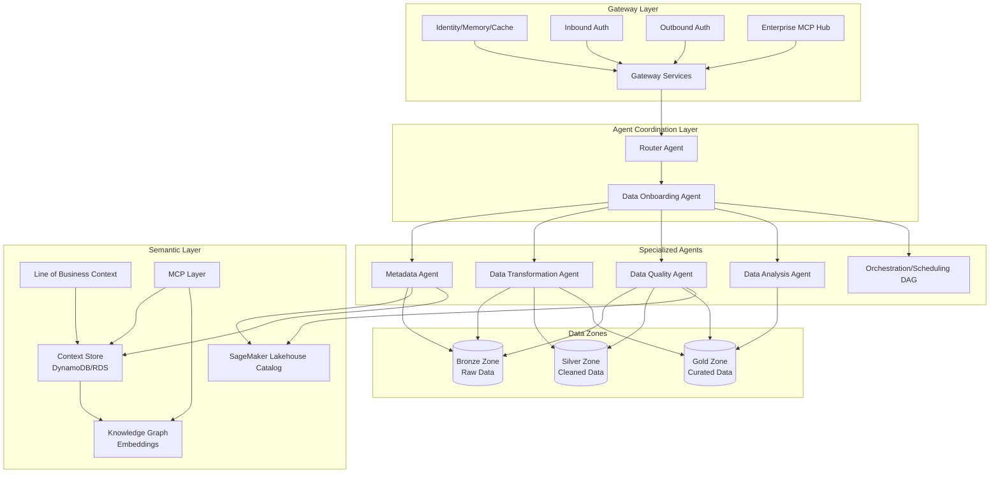
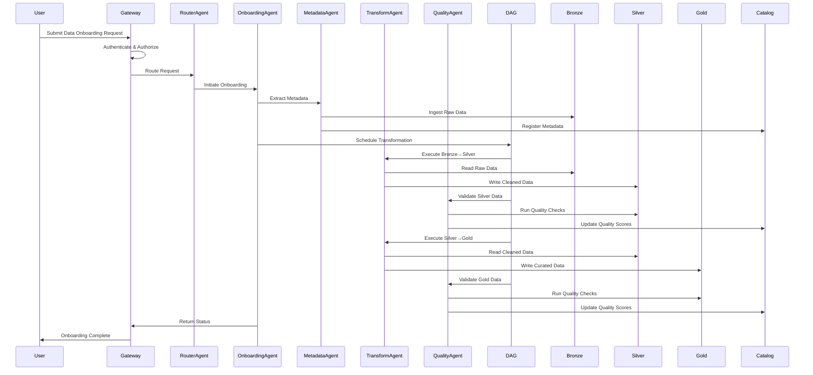
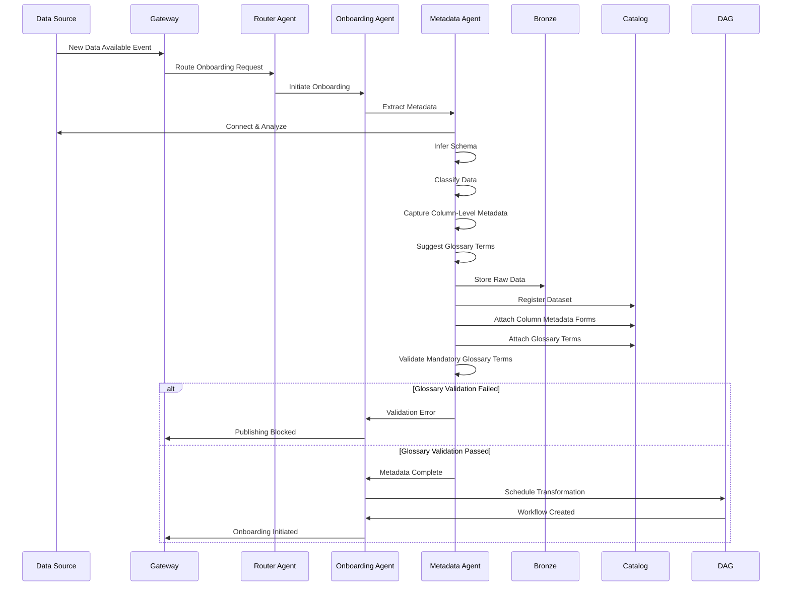
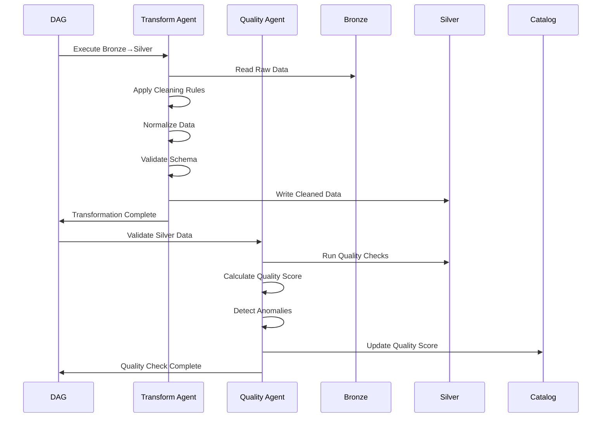
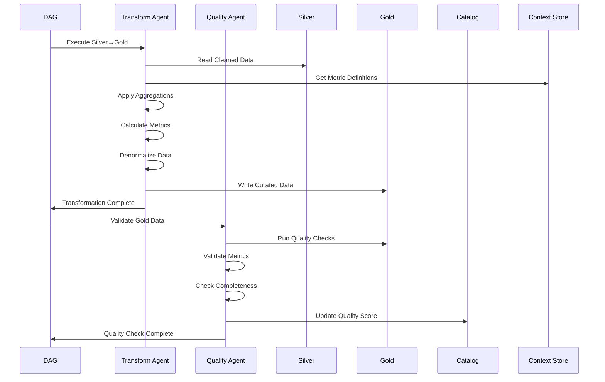
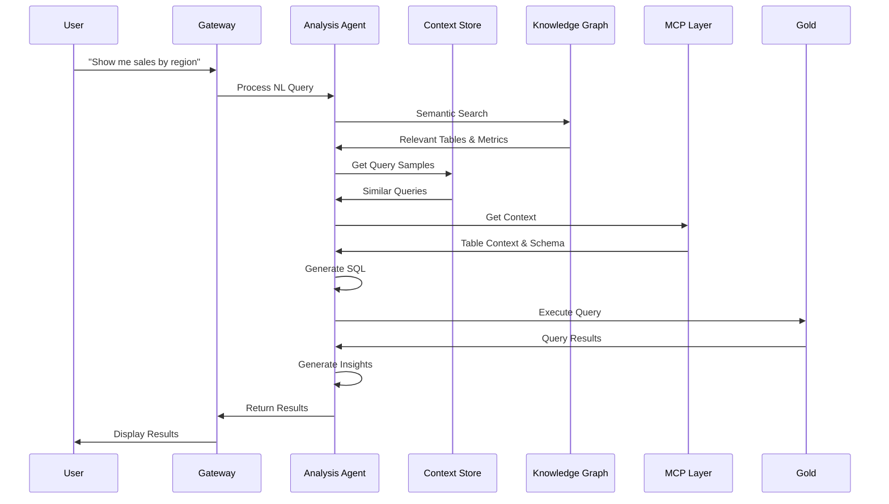
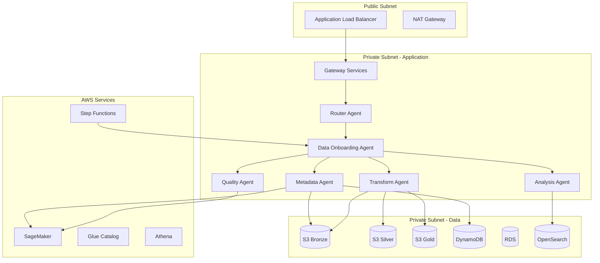

# Design Document: Agentic Data Onboarding System

## Overview

The Agentic Data Onboarding System is an autonomous data pipeline orchestration platform that coordinates data movement through Bronze → Silver → Gold zones with minimal human intervention. The system employs a multi-agent architecture where specialized agents collaborate to handle data ingestion, transformation, quality validation, metadata management, and analytics. The architecture integrates with AWS SageMaker Lakehouse, implements a semantic layer with knowledge graph capabilities, and provides Model Context Protocol (MCP) integration for enterprise-wide data operations.

The system is designed for automated operations with intelligent agent coordination, automatic metadata capture and cataloging, continuous data quality monitoring, and self-orchestrating workflows. The semantic layer enables natural language queries and context-aware data discovery through embeddings and knowledge graphs, while the gateway layer provides secure identity management, caching, and enterprise MCP hub integration.

## Architecture

### High-Level System Architecture




### Data Flow Architecture




## Components and Interfaces

### 1. Gateway Layer

#### Gateway Services

**Purpose**: Provides unified entry point for all system interactions with authentication, authorization, caching, and routing capabilities.

**Interface**:
```typescript
interface GatewayService {
  // Request handling
  handleRequest(request: InboundRequest): Promise<Response>
  
  // Authentication & Authorization
  authenticate(credentials: Credentials): Promise<AuthToken>
  authorize(token: AuthToken, resource: Resource): Promise<boolean>
  
  // Caching
  getCached(key: string): Promise<CachedData | null>
  setCached(key: string, data: any, ttl: number): Promise<void>
  
  // Memory management
  storeContext(sessionId: string, context: Context): Promise<void>
  retrieveContext(sessionId: string): Promise<Context>
}

interface InboundRequest {
  sessionId: string
  userId: string
  operation: string
  payload: any
  metadata: RequestMetadata
}

interface Credentials {
  type: 'api_key' | 'oauth' | 'saml' | 'jwt'
  token: string
  scope?: string[]
}
```

**Responsibilities**:
- Authenticate inbound requests using multiple auth mechanisms
- Authorize access to resources based on user roles and permissions
- Cache frequently accessed data and metadata
- Maintain session context and memory across requests
- Route requests to appropriate agents via Router Agent
- Integrate with Enterprise MCP Hub for cross-system operations


#### Identity/Memory/Cache Service

**Purpose**: Manages user identity, session memory, and distributed caching for performance optimization.

**Interface**:
```typescript
interface IdentityService {
  // Identity management
  validateIdentity(token: AuthToken): Promise<UserIdentity>
  getUserPermissions(userId: string): Promise<Permission[]>
  getUserRoles(userId: string): Promise<Role[]>
}

interface MemoryService {
  // Session memory
  storeSessionData(sessionId: string, key: string, value: any): Promise<void>
  getSessionData(sessionId: string, key: string): Promise<any>
  clearSession(sessionId: string): Promise<void>
  
  // Agent memory
  storeAgentState(agentId: string, state: AgentState): Promise<void>
  getAgentState(agentId: string): Promise<AgentState>
}

interface CacheService {
  // Distributed caching
  get(key: string): Promise<any | null>
  set(key: string, value: any, ttl: number): Promise<void>
  invalidate(pattern: string): Promise<void>
  
  // Cache warming
  warmCache(keys: string[]): Promise<void>
}
```

**Responsibilities**:
- Validate and manage user identities across sessions
- Store and retrieve session-specific context and state
- Provide distributed caching for metadata, query results, and embeddings
- Maintain agent state for coordination and recovery
- Support cache invalidation strategies for data freshness


### 2. Agent Coordination Layer

#### Router Agent

**Purpose**: Intelligent request routing and agent orchestration coordinator that determines which agents to invoke based on request type and system state.

**Interface**:
```typescript
interface RouterAgent {
  // Request routing
  route(request: AgentRequest): Promise<AgentResponse>
  
  // Agent discovery
  discoverAgents(capability: string): Promise<AgentInfo[]>
  
  // Load balancing
  selectAgent(agents: AgentInfo[], criteria: SelectionCriteria): Promise<AgentInfo>
  
  // Health monitoring
  checkAgentHealth(agentId: string): Promise<HealthStatus>
}

interface AgentRequest {
  requestId: string
  type: 'onboarding' | 'query' | 'transformation' | 'quality_check' | 'analysis'
  payload: any
  priority: 'low' | 'medium' | 'high' | 'critical'
  context: RequestContext
}

interface AgentInfo {
  agentId: string
  type: string
  capabilities: string[]
  status: 'available' | 'busy' | 'offline'
  load: number
  endpoint: string
}
```

**Responsibilities**:
- Route incoming requests to appropriate specialized agents
- Discover available agents and their capabilities
- Load balance requests across multiple agent instances
- Monitor agent health and availability
- Handle agent failures with retry and fallback strategies
- Maintain routing metrics and performance statistics


#### Data Onboarding Agent

**Purpose**: Orchestrates the end-to-end data onboarding process by coordinating specialized agents to move data through Bronze → Silver → Gold zones.

**Interface**:
```typescript
interface DataOnboardingAgent {
  // Onboarding orchestration
  initiateOnboarding(request: OnboardingRequest): Promise<OnboardingJob>
  
  // Job management
  getJobStatus(jobId: string): Promise<JobStatus>
  cancelJob(jobId: string): Promise<void>
  retryJob(jobId: string): Promise<void>
  
  // Agent coordination
  coordinateAgents(job: OnboardingJob): Promise<void>
  
  // Workflow management
  createWorkflow(job: OnboardingJob): Promise<WorkflowDefinition>
  executeWorkflow(workflow: WorkflowDefinition): Promise<WorkflowExecution>
}

interface OnboardingRequest {
  dataSource: DataSource
  targetZone: 'bronze' | 'silver' | 'gold'
  transformationRules?: TransformationRule[]
  qualityRules?: QualityRule[]
  schedule?: ScheduleConfig
  metadata?: Record<string, any>
}

interface OnboardingJob {
  jobId: string
  status: 'pending' | 'running' | 'completed' | 'failed' | 'cancelled'
  stages: JobStage[]
  startTime: Date
  endTime?: Date
  metrics: JobMetrics
}

interface JobStage {
  stageId: string
  name: string
  agent: string
  status: 'pending' | 'running' | 'completed' | 'failed'
  input: any
  output?: any
  error?: Error
}
```

**Responsibilities**:
- Orchestrate multi-stage data onboarding workflows
- Coordinate Metadata, Transformation, Quality, and Analysis agents
- Manage job lifecycle from initiation to completion
- Handle errors and implement retry logic
- Track job progress and metrics
- Provide status updates and notifications


### 3. Specialized Agents

#### Metadata Agent

**Purpose**: Automatically captures, extracts, and manages metadata from data sources and registers it in the SageMaker Lakehouse Catalog and Context Store.

**Interface**:
```typescript
interface MetadataAgent {
  // Metadata extraction
  extractMetadata(dataSource: DataSource): Promise<Metadata>
  
  // Schema inference
  inferSchema(data: any): Promise<Schema>
  
  // Catalog registration
  registerInCatalog(metadata: Metadata): Promise<CatalogEntry>
  updateCatalog(entryId: string, updates: Partial<Metadata>): Promise<void>
  
  // Column-level metadata management
  captureColumnMetadata(datasetId: string, columnName: string, metadata: ColumnMetadata): Promise<void>
  attachColumnMetadataForm(datasetId: string, columnName: string, form: MetadataForm): Promise<void>
  enrichColumnDescriptions(datasetId: string): Promise<void>  // Auto-generate rich markdown descriptions
  
  // Glossary term management
  suggestGlossaryTerms(datasetId: string, columnName: string): Promise<GlossaryTerm[]>
  validateGlossaryTerms(datasetId: string): Promise<GlossaryValidationResult>
  attachGlossaryTerms(datasetId: string, columnName: string, terms: GlossaryTerm[]): Promise<void>
  
  // Lineage tracking
  recordLineage(source: string, target: string, transformation: string): Promise<void>
  getLineage(datasetId: string): Promise<LineageGraph>
  
  // Classification
  classifyData(data: any): Promise<Classification[]>
}

interface ColumnMetadata {
  columnName: string
  businessName?: string
  description: string  // Markdown-formatted rich text
  dataType: string
  semanticType?: string
  metadataForm?: MetadataForm
  glossaryTerms: GlossaryTerm[]
  tags: string[]
  owner?: string
  steward?: string
}

interface Metadata {
  datasetId: string
  name: string
  description?: string
  schema: Schema
  source: DataSource
  format: string
  size: number
  recordCount: number
  createdAt: Date
  updatedAt: Date
  tags: string[]
  classifications: Classification[]
  qualityScore?: number
  lineage: LineageInfo[]
}

interface Schema {
  fields: Field[]
  primaryKey?: string[]
  foreignKeys?: ForeignKey[]
  indexes?: Index[]
}

interface Field {
  name: string
  type: string
  nullable: boolean
  description?: string  // Supports markdown formatting for rich text documentation
  constraints?: Constraint[]
  statistics?: FieldStatistics
  metadataForm?: MetadataForm  // Custom metadata form attached at column level
  glossaryTerms?: GlossaryTerm[]  // Business glossary terms for consistent terminology
}

interface MetadataForm {
  formId: string
  formName: string
  fields: MetadataFormField[]
  version: string
}

interface MetadataFormField {
  fieldName: string
  fieldType: 'text' | 'number' | 'date' | 'select' | 'multiselect'
  value: any
  required: boolean
  options?: string[]
}

interface GlossaryTerm {
  termId: string
  name: string
  definition: string
  category: string
  mandatory: boolean  // Whether this term is required during asset publishing
}
```

**Responsibilities**:
- Extract metadata from various data sources automatically
- Infer schema and data types from raw data
- Register datasets in SageMaker Lakehouse Catalog
- Capture and manage column-level metadata with custom forms
- Generate rich markdown-formatted descriptions for columns
- Suggest and attach business glossary terms to columns
- Validate mandatory glossary term requirements before publishing
- Track data lineage across transformations
- Classify data based on content and patterns
- Update metadata as data evolves
- Store metadata in Context Store for semantic queries


#### Data Transformation Agent

**Purpose**: Handles data transformations between zones (Bronze → Silver → Gold) with automated cleaning, normalization, and aggregation operations.

**Interface**:
```typescript
interface DataTransformationAgent {
  // Zone transformations
  transformBronzeToSilver(bronzeData: BronzeDataset): Promise<SilverDataset>
  transformSilverToGold(silverData: SilverDataset): Promise<GoldDataset>
  
  // Transformation operations
  applyTransformations(data: any, rules: TransformationRule[]): Promise<any>
  
  // Data cleaning
  cleanData(data: any, cleaningRules: CleaningRule[]): Promise<any>
  
  // Data normalization
  normalizeData(data: any, schema: Schema): Promise<any>
  
  // Data aggregation
  aggregateData(data: any, aggregations: Aggregation[]): Promise<any>
  
  // Transformation validation
  validateTransformation(input: any, output: any, rules: TransformationRule[]): Promise<ValidationResult>
}

interface TransformationRule {
  ruleId: string
  name: string
  type: 'filter' | 'map' | 'aggregate' | 'join' | 'pivot' | 'custom'
  config: any
  priority: number
}

interface CleaningRule {
  field: string
  operations: CleaningOperation[]
}

interface CleaningOperation {
  type: 'remove_nulls' | 'remove_duplicates' | 'trim' | 'standardize' | 'impute'
  config?: any
}

interface Aggregation {
  groupBy: string[]
  measures: Measure[]
  filters?: Filter[]
}

interface Measure {
  field: string
  function: 'sum' | 'avg' | 'count' | 'min' | 'max' | 'stddev'
  alias?: string
}
```

**Responsibilities**:
- Transform raw data from Bronze to cleaned Silver zone
- Transform cleaned data from Silver to curated Gold zone
- Apply configurable transformation rules
- Clean data by removing nulls, duplicates, and standardizing formats
- Normalize data to conform to target schemas
- Aggregate data for analytics use cases
- Validate transformations to ensure correctness
- Log transformation operations for lineage tracking


#### Data Quality Agent

**Purpose**: Validates data quality across all zones with automated quality checks, scoring, and anomaly detection.

**Interface**:
```typescript
interface DataQualityAgent {
  // Quality assessment
  assessQuality(dataset: Dataset, rules: QualityRule[]): Promise<QualityReport>
  
  // Quality checks
  runQualityChecks(dataset: Dataset): Promise<QualityCheckResult[]>
  
  // Anomaly detection
  detectAnomalies(dataset: Dataset): Promise<Anomaly[]>
  
  // Quality scoring
  calculateQualityScore(results: QualityCheckResult[]): Promise<number>
  
  // Quality monitoring
  monitorQuality(datasetId: string): Promise<QualityTrend>
  
  // Remediation
  suggestRemediation(issues: QualityIssue[]): Promise<RemediationPlan>
}

interface QualityRule {
  ruleId: string
  name: string
  type: 'completeness' | 'accuracy' | 'consistency' | 'validity' | 'uniqueness' | 'timeliness'
  condition: string
  threshold: number
  severity: 'low' | 'medium' | 'high' | 'critical'
}

interface QualityReport {
  datasetId: string
  timestamp: Date
  overallScore: number
  dimensions: QualityDimension[]
  issues: QualityIssue[]
  recommendations: string[]
}

interface QualityDimension {
  name: string
  score: number
  checks: QualityCheckResult[]
}

interface QualityCheckResult {
  checkId: string
  rule: QualityRule
  passed: boolean
  value: number
  threshold: number
  message: string
}

interface Anomaly {
  field: string
  type: 'outlier' | 'missing_pattern' | 'distribution_shift' | 'format_violation'
  severity: string
  description: string
  affectedRecords: number
}
```

**Responsibilities**:
- Run automated quality checks on datasets
- Assess data quality across multiple dimensions
- Detect anomalies and data quality issues
- Calculate quality scores and update catalog
- Monitor quality trends over time
- Suggest remediation actions for quality issues
- Alert on critical quality violations
- Validate data against business rules


#### Data Analysis Agent

**Purpose**: Performs analytics on Gold zone data, generates insights, and responds to analytical queries using the semantic layer.

**Interface**:
```typescript
interface DataAnalysisAgent {
  // Query execution
  executeQuery(query: AnalyticalQuery): Promise<QueryResult>
  
  // Natural language queries
  processNaturalLanguageQuery(nlQuery: string, context: QueryContext): Promise<QueryResult>
  
  // Insight generation
  generateInsights(dataset: Dataset): Promise<Insight[]>
  
  // Statistical analysis
  performStatisticalAnalysis(dataset: Dataset, analysis: AnalysisType): Promise<AnalysisResult>
  
  // Visualization
  generateVisualization(data: any, vizType: VisualizationType): Promise<Visualization>
  
  // Metric calculation
  calculateMetrics(dataset: Dataset, metrics: MetricDefinition[]): Promise<MetricResult[]>
}

interface AnalyticalQuery {
  queryId: string
  sql?: string
  naturalLanguage?: string
  filters?: Filter[]
  aggregations?: Aggregation[]
  limit?: number
  offset?: number
}

interface QueryResult {
  queryId: string
  data: any[]
  schema: Schema
  rowCount: number
  executionTime: number
  metadata: QueryMetadata
}

interface Insight {
  type: 'trend' | 'correlation' | 'outlier' | 'pattern' | 'recommendation'
  title: string
  description: string
  confidence: number
  data: any
  visualization?: Visualization
}

interface MetricDefinition {
  name: string
  calculation: string
  dimensions?: string[]
  filters?: Filter[]
}
```

**Responsibilities**:
- Execute analytical queries on Gold zone data
- Process natural language queries using semantic layer
- Generate automated insights from data
- Perform statistical analysis and calculations
- Calculate business metrics based on definitions
- Generate visualizations for insights
- Leverage knowledge graph for context-aware queries
- Cache frequently used query results


#### Orchestration/Scheduling DAG

**Purpose**: Manages workflow execution, scheduling, and dependencies between data pipeline stages with automated retry and error handling.

**Interface**:
```typescript
interface OrchestrationDAG {
  // Workflow management
  createWorkflow(definition: WorkflowDefinition): Promise<Workflow>
  executeWorkflow(workflowId: string, params?: any): Promise<WorkflowExecution>
  
  // Scheduling
  scheduleWorkflow(workflowId: string, schedule: Schedule): Promise<ScheduledWorkflow>
  cancelSchedule(scheduleId: string): Promise<void>
  
  // Task management
  executeTask(task: Task): Promise<TaskExecution>
  retryTask(taskId: string): Promise<TaskExecution>
  
  // Dependency management
  resolveDependencies(task: Task): Promise<Task[]>
  
  // Monitoring
  getWorkflowStatus(workflowId: string): Promise<WorkflowStatus>
  getTaskStatus(taskId: string): Promise<TaskStatus>
}

interface WorkflowDefinition {
  workflowId: string
  name: string
  description?: string
  tasks: Task[]
  dependencies: Dependency[]
  config: WorkflowConfig
}

interface Task {
  taskId: string
  name: string
  agent: string
  operation: string
  input: any
  retryPolicy: RetryPolicy
  timeout: number
  dependencies: string[]
}

interface Schedule {
  type: 'cron' | 'interval' | 'event'
  expression: string
  timezone?: string
  startDate?: Date
  endDate?: Date
}

interface WorkflowExecution {
  executionId: string
  workflowId: string
  status: 'running' | 'completed' | 'failed' | 'cancelled'
  startTime: Date
  endTime?: Date
  taskExecutions: TaskExecution[]
  metrics: ExecutionMetrics
}

interface TaskExecution {
  taskId: string
  status: 'pending' | 'running' | 'completed' | 'failed' | 'skipped'
  startTime: Date
  endTime?: Date
  attempts: number
  output?: any
  error?: Error
}
```

**Responsibilities**:
- Create and manage workflow definitions
- Execute workflows with proper task ordering
- Schedule recurring workflows based on cron or interval
- Resolve task dependencies and execution order
- Retry failed tasks based on retry policies
- Handle task timeouts and failures
- Monitor workflow and task execution status
- Provide execution metrics and logs
- Support event-driven workflow triggers


### 4. Data Zones

#### Bronze Zone (Raw Data)

**Purpose**: Stores raw, unprocessed data exactly as ingested from source systems with minimal transformation.

**Data Model**:
```typescript
interface BronzeDataset {
  datasetId: string
  source: DataSource
  format: 'json' | 'csv' | 'parquet' | 'avro' | 'xml' | 'binary'
  location: string
  ingestionTime: Date
  rawData: any
  metadata: {
    recordCount: number
    sizeBytes: number
    checksum: string
    compressionType?: string
  }
  partitionKeys?: string[]
}

interface DataSource {
  sourceId: string
  type: 'database' | 'api' | 'file' | 'stream' | 'message_queue'
  connectionInfo: ConnectionInfo
  extractionMethod: 'full' | 'incremental' | 'cdc'
  lastExtractedAt?: Date
}
```

**Storage Strategy**:
- Immutable storage - data never modified after ingestion
- Partitioned by ingestion date for efficient querying
- Compressed using appropriate codec (Snappy, Gzip, LZ4)
- Stored in columnar format (Parquet) for analytics workloads
- Retention policy based on compliance requirements

**Validation Rules**:
- Data must have valid source identifier
- Ingestion timestamp must be recorded
- Checksum must be calculated for integrity
- Metadata must be captured before storage


#### Silver Zone (Cleaned Data)

**Purpose**: Stores cleaned, validated, and standardized data ready for business use with enforced schema and quality checks.

**Data Model**:
```typescript
interface SilverDataset {
  datasetId: string
  bronzeDatasetId: string
  schema: Schema
  location: string
  transformationTime: Date
  qualityScore: number
  data: any
  metadata: {
    recordCount: number
    validRecordCount: number
    invalidRecordCount: number
    transformationRules: string[]
    qualityChecks: string[]
  }
  partitionKeys?: string[]
}
```

**Storage Strategy**:
- Schema enforced and validated
- Partitioned by business dimensions (date, region, category)
- Optimized for query performance
- Indexed on frequently queried columns
- Incremental updates supported
- Change data capture enabled

**Validation Rules**:
- Schema must match registered schema in catalog
- All required fields must be present
- Data types must be correct
- Quality score must meet minimum threshold
- Referential integrity must be maintained
- Business rules must be satisfied


#### Gold Zone (Curated Data)

**Purpose**: Stores highly curated, aggregated, and business-ready data optimized for analytics and reporting with pre-calculated metrics.

**Data Model**:
```typescript
interface GoldDataset {
  datasetId: string
  silverDatasetIds: string[]
  businessEntity: string
  schema: Schema
  location: string
  aggregationTime: Date
  data: any
  metadata: {
    recordCount: number
    aggregationLevel: string
    metrics: MetricDefinition[]
    dimensions: string[]
    refreshFrequency: string
    lastRefreshedAt: Date
  }
  partitionKeys?: string[]
}
```

**Storage Strategy**:
- Denormalized for query performance
- Pre-aggregated at multiple granularities
- Materialized views for common queries
- Partitioned by time and business dimensions
- Optimized for BI tool consumption
- SCD Type 2 for historical tracking

**Validation Rules**:
- All metrics must be calculated correctly
- Aggregations must be consistent
- Historical data must be preserved
- Business logic must be applied
- Data must be complete for reporting periods
- Quality score must be above 95%


### 5. Semantic Layer Components

#### AWS SageMaker Lakehouse Catalog

**Purpose**: Central metadata repository storing table definitions, data lineage, quality scores, and classifications for all datasets.

**Interface**:
```typescript
interface LakehouseCatalog {
  // Catalog management
  registerTable(table: TableDefinition): Promise<CatalogEntry>
  updateTable(tableId: string, updates: Partial<TableDefinition>): Promise<void>
  getTable(tableId: string): Promise<TableDefinition>
  searchTables(query: SearchQuery): Promise<TableDefinition[]>
  
  // Column-level metadata management
  attachColumnMetadataForm(tableId: string, columnName: string, form: MetadataForm): Promise<void>
  updateColumnMetadataForm(tableId: string, columnName: string, formId: string, updates: Partial<MetadataForm>): Promise<void>
  getColumnMetadataForm(tableId: string, columnName: string): Promise<MetadataForm | null>
  removeColumnMetadataForm(tableId: string, columnName: string, formId: string): Promise<void>
  
  // Glossary term management
  attachGlossaryTerms(tableId: string, columnName: string, terms: GlossaryTerm[]): Promise<void>
  validateGlossaryTerms(tableId: string): Promise<GlossaryValidationResult>
  enforceGlossaryTerms(tableId: string, enforceMandatory: boolean): Promise<void>
  getGlossaryTerms(tableId: string, columnName?: string): Promise<GlossaryTerm[]>
  
  // Lineage management
  recordLineage(lineage: LineageRecord): Promise<void>
  getLineage(tableId: string, direction: 'upstream' | 'downstream'): Promise<LineageGraph>
  
  // Quality tracking
  updateQualityScore(tableId: string, score: number, report: QualityReport): Promise<void>
  getQualityHistory(tableId: string): Promise<QualityHistory>
  
  // Classification
  classifyTable(tableId: string, classifications: Classification[]): Promise<void>
  getClassifications(tableId: string): Promise<Classification[]>
}

interface GlossaryValidationResult {
  valid: boolean
  missingMandatoryTerms: MissingTermInfo[]
  warnings: string[]
}

interface MissingTermInfo {
  tableId: string
  columnName: string
  requiredTermCategory: string
  message: string
}

interface TableDefinition {
  tableId: string
  name: string
  database: string
  description?: string
  schema: Schema
  location: string
  format: string
  partitionKeys: string[]
  createdAt: Date
  updatedAt: Date
  owner: string
  tags: Record<string, string>
  properties: Record<string, any>
}

interface LineageRecord {
  sourceId: string
  targetId: string
  transformationType: string
  transformationLogic?: string
  timestamp: Date
  agent: string
}

interface LineageGraph {
  nodes: LineageNode[]
  edges: LineageEdge[]
}

interface Classification {
  type: 'PII' | 'PHI' | 'PCI' | 'confidential' | 'public' | 'internal'
  confidence: number
  fields?: string[]
}
```

**Responsibilities**:
- Store and manage table definitions and schemas
- Track data lineage across transformations
- Maintain quality scores and historical trends
- Classify data based on sensitivity and compliance
- Provide search and discovery capabilities
- Support versioning of table definitions
- Integrate with AWS Glue Data Catalog


#### Context Store (DynamoDB/RDS)

**Purpose**: Stores data model in knowledge graph format with query samples, table joins, primary/foreign keys, and metrics calculations for semantic query understanding.

**Interface**:
```typescript
interface ContextStore {
  // Data model management
  storeDataModel(model: DataModel): Promise<void>
  getDataModel(modelId: string): Promise<DataModel>
  updateDataModel(modelId: string, updates: Partial<DataModel>): Promise<void>
  
  // Relationship management
  storeRelationship(relationship: Relationship): Promise<void>
  getRelationships(entityId: string): Promise<Relationship[]>
  
  // Query samples
  storeQuerySample(sample: QuerySample): Promise<void>
  getQuerySamples(context: string): Promise<QuerySample[]>
  
  // Metrics definitions
  storeMetric(metric: MetricDefinition): Promise<void>
  getMetrics(category?: string): Promise<MetricDefinition[]>
  
  // Business context
  storeBusinessContext(context: BusinessContext): Promise<void>
  getBusinessContext(domain: string): Promise<BusinessContext>
}

interface DataModel {
  modelId: string
  name: string
  version: string
  entities: Entity[]
  relationships: Relationship[]
  createdAt: Date
  updatedAt: Date
}

interface Entity {
  entityId: string
  name: string
  type: string
  description?: string
  attributes: Attribute[]
  primaryKey: string[]
  indexes: Index[]
}

interface Relationship {
  relationshipId: string
  sourceEntity: string
  targetEntity: string
  type: 'one-to-one' | 'one-to-many' | 'many-to-many'
  joinCondition: JoinCondition
  description?: string
}

interface JoinCondition {
  sourceKeys: string[]
  targetKeys: string[]
  joinType: 'inner' | 'left' | 'right' | 'full'
}

interface QuerySample {
  sampleId: string
  naturalLanguage: string
  sql: string
  context: string
  entities: string[]
  metrics: string[]
  filters?: string[]
  usageCount: number
}
```

**Responsibilities**:
- Store data model as knowledge graph
- Maintain entity relationships and join paths
- Store query samples for natural language understanding
- Define and store metric calculations
- Provide business context for data interpretation
- Support semantic query translation
- Enable data discovery through relationships


#### Line of Business Context

**Purpose**: Provides business domain context, data literacy information, and commonly used queries specific to different business units.

**Interface**:
```typescript
interface LineOfBusinessContext {
  // LOB management
  registerLOB(lob: LOBDefinition): Promise<void>
  getLOB(lobId: string): Promise<LOBDefinition>
  
  // Business glossary
  storeBusinessTerm(term: BusinessTerm): Promise<void>
  getBusinessTerms(lobId: string): Promise<BusinessTerm[]>
  
  // Common queries
  storeCommonQuery(query: CommonQuery): Promise<void>
  getCommonQueries(lobId: string): Promise<CommonQuery[]>
  
  // Data literacy
  storeDataLiteracy(literacy: DataLiteracy): Promise<void>
  getDataLiteracy(lobId: string, role: string): Promise<DataLiteracy>
}

interface LOBDefinition {
  lobId: string
  name: string
  description: string
  domains: string[]
  keyMetrics: string[]
  dataAssets: string[]
  stakeholders: Stakeholder[]
}

interface BusinessTerm {
  termId: string
  name: string
  definition: string
  synonyms: string[]
  relatedTerms: string[]
  dataMapping: DataMapping[]
  examples: string[]
}

interface CommonQuery {
  queryId: string
  name: string
  description: string
  naturalLanguage: string
  sql: string
  frequency: number
  lastUsed: Date
  category: string
}

interface DataLiteracy {
  role: string
  skillLevel: 'beginner' | 'intermediate' | 'advanced' | 'expert'
  preferredQueryStyle: 'natural_language' | 'sql' | 'visual'
  commonTasks: string[]
  trainingResources: string[]
}
```

**Responsibilities**:
- Maintain business glossary and terminology
- Store commonly used queries by business unit
- Provide data literacy guidance by role
- Map business terms to technical data elements
- Support business-friendly query interfaces
- Enable self-service analytics for business users


#### Knowledge Graph (Embeddings)

**Purpose**: Enables semantic search and context-aware queries through vector embeddings of metadata, schemas, and business context.

**Interface**:
```typescript
interface KnowledgeGraph {
  // Embedding generation
  generateEmbedding(text: string, type: EmbeddingType): Promise<Embedding>
  
  // Semantic search
  semanticSearch(query: string, filters?: SearchFilter[]): Promise<SearchResult[]>
  
  // Similarity search
  findSimilar(embeddingId: string, topK: number): Promise<SimilarityResult[]>
  
  // Graph operations
  addNode(node: GraphNode): Promise<void>
  addEdge(edge: GraphEdge): Promise<void>
  queryGraph(query: GraphQuery): Promise<GraphResult>
  
  // Context retrieval
  getRelevantContext(query: string, maxTokens: number): Promise<Context[]>
}

interface Embedding {
  embeddingId: string
  vector: number[]
  text: string
  type: EmbeddingType
  metadata: Record<string, any>
  createdAt: Date
}

type EmbeddingType = 'table' | 'column' | 'query' | 'metric' | 'business_term' | 'documentation'

interface SearchResult {
  id: string
  type: string
  name: string
  description: string
  score: number
  metadata: any
}

interface GraphNode {
  nodeId: string
  type: string
  properties: Record<string, any>
  embedding?: Embedding
}

interface GraphEdge {
  edgeId: string
  sourceId: string
  targetId: string
  type: string
  properties: Record<string, any>
}

interface GraphQuery {
  startNode?: string
  pattern: string
  filters?: Record<string, any>
  limit?: number
}
```

**Responsibilities**:
- Generate embeddings for all metadata and context
- Enable semantic search across data catalog
- Find similar tables, queries, and metrics
- Support natural language query understanding
- Provide relevant context for query generation
- Maintain knowledge graph of data relationships
- Support vector similarity search


#### MCP Layer (Model Context Protocol)

**Purpose**: Provides standardized protocol for AI models to interact with the data platform, enabling context-aware operations and tool use.

**Interface**:
```typescript
interface MCPLayer {
  // Tool registration
  registerTool(tool: MCPTool): Promise<void>
  getTools(category?: string): Promise<MCPTool[]>
  
  // Context management
  provideContext(request: ContextRequest): Promise<MCPContext>
  
  // Tool execution
  executeTool(toolName: string, params: any): Promise<ToolResult>
  
  // Resource access
  getResource(resourceUri: string): Promise<Resource>
  listResources(pattern: string): Promise<Resource[]>
  
  // Prompt management
  getPrompt(promptName: string, variables?: Record<string, any>): Promise<string>
  
  // Sampling
  createSamplingRequest(request: SamplingRequest): Promise<SamplingResponse>
}

interface MCPTool {
  name: string
  description: string
  inputSchema: JSONSchema
  category: string
  handler: string
}

interface ContextRequest {
  query: string
  maxTokens: number
  includeTypes: string[]
  filters?: Record<string, any>
}

interface MCPContext {
  tables: TableContext[]
  relationships: Relationship[]
  metrics: MetricDefinition[]
  samples: QuerySample[]
  businessContext: string
}

interface TableContext {
  name: string
  description: string
  schema: Schema
  sampleData?: any[]
  statistics?: TableStatistics
}

interface ToolResult {
  success: boolean
  data?: any
  error?: string
  metadata?: Record<string, any>
}

interface Resource {
  uri: string
  type: string
  name: string
  description?: string
  content?: any
  metadata?: Record<string, any>
}
```

**Responsibilities**:
- Expose data platform capabilities as MCP tools
- Provide relevant context for AI model operations
- Enable tool use for data operations
- Support resource discovery and access
- Manage prompts for common operations
- Integrate with Enterprise MCP Hub
- Support sampling for model interactions


## Data Flow Patterns

### Pattern 1: Automated Data Onboarding



### Pattern 2: Bronze to Silver Transformation




### Pattern 3: Silver to Gold Aggregation



### Pattern 4: Natural Language Query Processing




## API Specifications

### Gateway API

**Base URL**: `/api/v1`

#### Authentication Endpoints

```
POST /auth/login
Request:
{
  "type": "api_key" | "oauth" | "saml" | "jwt",
  "credentials": {
    "token": "string",
    "scope": ["string"]
  }
}

Response:
{
  "authToken": "string",
  "expiresAt": "ISO8601",
  "refreshToken": "string",
  "user": {
    "userId": "string",
    "roles": ["string"],
    "permissions": ["string"]
  }
}
```

#### Data Onboarding Endpoints

```
POST /onboarding/initiate
Request:
{
  "dataSource": {
    "sourceId": "string",
    "type": "database" | "api" | "file" | "stream",
    "connectionInfo": {},
    "extractionMethod": "full" | "incremental" | "cdc"
  },
  "targetZone": "bronze" | "silver" | "gold",
  "transformationRules": [],
  "qualityRules": [],
  "schedule": {
    "type": "cron" | "interval" | "event",
    "expression": "string"
  }
}

Response:
{
  "jobId": "string",
  "status": "pending",
  "createdAt": "ISO8601",
  "estimatedCompletionTime": "ISO8601"
}

GET /onboarding/jobs/{jobId}
Response:
{
  "jobId": "string",
  "status": "pending" | "running" | "completed" | "failed",
  "stages": [
    {
      "stageId": "string",
      "name": "string",
      "agent": "string",
      "status": "string",
      "startTime": "ISO8601",
      "endTime": "ISO8601"
    }
  ],
  "metrics": {
    "recordsProcessed": 0,
    "recordsFailed": 0,
    "duration": 0
  }
}

POST /onboarding/jobs/{jobId}/cancel
Response:
{
  "jobId": "string",
  "status": "cancelled",
  "cancelledAt": "ISO8601"
}
```


#### Metadata API

```
GET /metadata/datasets
Query Parameters:
  - zone: bronze | silver | gold
  - source: string
  - tags: string[]
  - limit: number
  - offset: number

Response:
{
  "datasets": [
    {
      "datasetId": "string",
      "name": "string",
      "zone": "string",
      "schema": {},
      "qualityScore": 0.95,
      "recordCount": 0,
      "createdAt": "ISO8601"
    }
  ],
  "total": 0,
  "limit": 0,
  "offset": 0
}

GET /metadata/datasets/{datasetId}
Response:
{
  "datasetId": "string",
  "name": "string",
  "description": "string",
  "schema": {
    "fields": [
      {
        "name": "string",
        "type": "string",
        "nullable": true,
        "description": "string (markdown-formatted)",
        "metadataForm": {
          "formId": "string",
          "formName": "string",
          "fields": []
        },
        "glossaryTerms": [
          {
            "termId": "string",
            "name": "string",
            "definition": "string",
            "mandatory": true
          }
        ]
      }
    ]
  },
  "source": {},
  "qualityScore": 0.95,
  "lineage": {
    "upstream": ["string"],
    "downstream": ["string"]
  },
  "classifications": ["string"]
}

POST /metadata/datasets/{datasetId}/columns/{columnName}/metadata-form
Request:
{
  "formId": "string",
  "formName": "string",
  "fields": [
    {
      "fieldName": "string",
      "fieldType": "text" | "number" | "date" | "select",
      "value": "any",
      "required": true,
      "options": ["string"]
    }
  ],
  "version": "string"
}

Response:
{
  "success": true,
  "datasetId": "string",
  "columnName": "string",
  "formId": "string"
}

GET /metadata/datasets/{datasetId}/columns/{columnName}/metadata-form
Response:
{
  "formId": "string",
  "formName": "string",
  "fields": [],
  "version": "string",
  "createdAt": "ISO8601",
  "updatedAt": "ISO8601"
}

POST /metadata/datasets/{datasetId}/columns/{columnName}/glossary-terms
Request:
{
  "terms": [
    {
      "termId": "string",
      "name": "string",
      "definition": "string",
      "category": "string",
      "mandatory": true
    }
  ]
}

Response:
{
  "success": true,
  "datasetId": "string",
  "columnName": "string",
  "attachedTerms": ["string"]
}

POST /metadata/datasets/{datasetId}/validate-glossary
Request:
{
  "enforceMandatory": true
}

Response:
{
  "valid": true,
  "missingMandatoryTerms": [
    {
      "columnName": "string",
      "requiredTermCategory": "string",
      "message": "string"
    }
  ],
  "warnings": ["string"]
}

GET /metadata/lineage/{datasetId}
Query Parameters:
  - direction: upstream | downstream
  - depth: number

Response:
{
  "nodes": [
    {
      "id": "string",
      "name": "string",
      "type": "string"
    }
  ],
  "edges": [
    {
      "source": "string",
      "target": "string",
      "transformation": "string"
    }
  ]
}
```


#### Quality API

```
POST /quality/assess
Request:
{
  "datasetId": "string",
  "rules": [
    {
      "ruleId": "string",
      "type": "completeness" | "accuracy" | "consistency",
      "condition": "string",
      "threshold": 0.95
    }
  ]
}

Response:
{
  "reportId": "string",
  "datasetId": "string",
  "overallScore": 0.95,
  "dimensions": [
    {
      "name": "completeness",
      "score": 0.98,
      "checks": []
    }
  ],
  "issues": [
    {
      "severity": "high",
      "description": "string",
      "affectedRecords": 0
    }
  ]
}

GET /quality/reports/{datasetId}
Query Parameters:
  - startDate: ISO8601
  - endDate: ISO8601

Response:
{
  "reports": [
    {
      "reportId": "string",
      "timestamp": "ISO8601",
      "overallScore": 0.95,
      "issueCount": 0
    }
  ]
}

GET /quality/trends/{datasetId}
Response:
{
  "datasetId": "string",
  "trend": [
    {
      "date": "ISO8601",
      "score": 0.95
    }
  ],
  "averageScore": 0.94,
  "improvement": 0.02
}
```


#### Analysis API

```
POST /analysis/query
Request:
{
  "query": "string",
  "type": "natural_language" | "sql",
  "context": {
    "lob": "string",
    "role": "string"
  },
  "limit": 1000
}

Response:
{
  "queryId": "string",
  "data": [],
  "schema": {},
  "rowCount": 0,
  "executionTime": 0,
  "insights": [
    {
      "type": "trend",
      "title": "string",
      "description": "string",
      "confidence": 0.85
    }
  ]
}

POST /analysis/insights/{datasetId}
Request:
{
  "analysisTypes": ["trend", "correlation", "outlier"]
}

Response:
{
  "insights": [
    {
      "type": "trend",
      "title": "string",
      "description": "string",
      "confidence": 0.85,
      "data": {},
      "visualization": {}
    }
  ]
}

GET /analysis/metrics
Query Parameters:
  - category: string
  - lob: string

Response:
{
  "metrics": [
    {
      "name": "string",
      "description": "string",
      "calculation": "string",
      "dimensions": ["string"],
      "category": "string"
    }
  ]
}
```


#### Semantic Search API

```
POST /semantic/search
Request:
{
  "query": "string",
  "types": ["table", "column", "metric", "query"],
  "filters": {
    "zone": "gold",
    "lob": "string"
  },
  "limit": 10
}

Response:
{
  "results": [
    {
      "id": "string",
      "type": "table",
      "name": "string",
      "description": "string",
      "score": 0.92,
      "metadata": {}
    }
  ]
}

POST /semantic/similar
Request:
{
  "referenceId": "string",
  "type": "table" | "query" | "metric",
  "topK": 5
}

Response:
{
  "similar": [
    {
      "id": "string",
      "name": "string",
      "similarity": 0.88,
      "metadata": {}
    }
  ]
}

GET /semantic/context
Query Parameters:
  - query: string
  - maxTokens: number
  - includeTypes: string[]

Response:
{
  "tables": [],
  "relationships": [],
  "metrics": [],
  "samples": [],
  "businessContext": "string"
}
```


#### Workflow API

```
POST /workflows/create
Request:
{
  "name": "string",
  "description": "string",
  "tasks": [
    {
      "taskId": "string",
      "name": "string",
      "agent": "string",
      "operation": "string",
      "input": {},
      "dependencies": ["string"],
      "retryPolicy": {
        "maxAttempts": 3,
        "backoff": "exponential"
      }
    }
  ],
  "schedule": {
    "type": "cron",
    "expression": "0 0 * * *"
  }
}

Response:
{
  "workflowId": "string",
  "status": "created",
  "createdAt": "ISO8601"
}

POST /workflows/{workflowId}/execute
Request:
{
  "parameters": {}
}

Response:
{
  "executionId": "string",
  "workflowId": "string",
  "status": "running",
  "startTime": "ISO8601"
}

GET /workflows/executions/{executionId}
Response:
{
  "executionId": "string",
  "workflowId": "string",
  "status": "running" | "completed" | "failed",
  "startTime": "ISO8601",
  "endTime": "ISO8601",
  "taskExecutions": [
    {
      "taskId": "string",
      "status": "completed",
      "startTime": "ISO8601",
      "endTime": "ISO8601",
      "attempts": 1
    }
  ],
  "metrics": {
    "duration": 0,
    "tasksCompleted": 0,
    "tasksFailed": 0
  }
}
```


## Error Handling

### Error Scenario 1: Data Source Connection Failure

**Condition**: Unable to connect to data source during onboarding
**Response**: 
- Metadata Agent returns connection error with details
- Onboarding Agent logs error and marks job as failed
- System attempts retry based on retry policy (exponential backoff)
- After max retries, sends notification to admin

**Recovery**:
- Validate connection credentials
- Check network connectivity
- Verify source system availability
- Update connection info and retry job

### Error Scenario 2: Schema Mismatch During Transformation

**Condition**: Data schema doesn't match expected schema during Bronze→Silver transformation
**Response**:
- Transformation Agent detects schema mismatch
- Logs detailed error with field-level differences
- Marks transformation as failed
- Stores problematic records in error table

**Recovery**:
- Update schema in catalog if source schema changed
- Apply schema evolution rules
- Reprocess failed records with updated schema
- Update transformation rules if needed

### Error Scenario 3: Quality Check Failure

**Condition**: Data quality score falls below threshold
**Response**:
- Quality Agent generates detailed quality report
- Identifies specific quality issues and affected records
- Blocks promotion to next zone if critical
- Sends alert to data steward

**Recovery**:
- Review quality report and identify root cause
- Apply data remediation rules
- Reprocess data with corrections
- Update quality rules if threshold too strict

### Error Scenario 4: Workflow Task Timeout

**Condition**: Task execution exceeds configured timeout
**Response**:
- DAG terminates task execution
- Marks task as failed with timeout error
- Releases resources allocated to task
- Triggers retry if retry policy allows

**Recovery**:
- Investigate task performance issues
- Optimize task logic or increase timeout
- Scale resources if needed
- Retry task execution


### Error Scenario 5: Agent Unavailability

**Condition**: Required agent is offline or unresponsive
**Response**:
- Router Agent detects agent health check failure
- Attempts to route to backup agent instance
- If no backup available, queues request
- Logs incident and sends alert

**Recovery**:
- Restart failed agent
- Scale up agent instances
- Process queued requests
- Update agent health status

### Error Scenario 6: Semantic Search Failure

**Condition**: Knowledge graph or embedding service unavailable
**Response**:
- Analysis Agent falls back to keyword search
- Logs degraded service warning
- Returns results with lower confidence
- Continues operation with reduced functionality

**Recovery**:
- Restore knowledge graph service
- Rebuild embeddings if corrupted
- Validate search functionality
- Resume full semantic search

### Error Scenario 7: Glossary Term Validation Failure

**Condition**: Dataset publishing blocked due to missing mandatory glossary terms
**Response**:
- Metadata Agent validates glossary terms before catalog registration
- Identifies columns missing required glossary terms
- Generates detailed validation report with missing terms
- Blocks dataset publishing to catalog
- Sends notification to data steward with remediation guidance

**Recovery**:
- Review validation report to identify missing terms
- Attach required glossary terms to columns
- Re-run glossary term validation
- Retry dataset publishing once validation passes
- Update metadata policies if term requirements too strict

## Testing Strategy

### Unit Testing Approach

Each agent and component will have comprehensive unit tests covering:

**Agent Testing**:
- Test each agent interface method independently
- Mock dependencies (other agents, data stores, external services)
- Verify correct handling of valid inputs
- Test error handling for invalid inputs
- Validate retry logic and timeout behavior
- Test state management and recovery

**Data Zone Testing**:
- Test data ingestion and storage
- Verify schema validation
- Test partitioning logic
- Validate data retrieval operations
- Test data retention policies

**Semantic Layer Testing**:
- Test metadata registration and retrieval
- Verify lineage tracking accuracy
- Test embedding generation and search
- Validate context retrieval
- Test MCP tool execution

**Coverage Goals**: Minimum 80% code coverage for all components


### Integration Testing Approach

Test interactions between components and agents:

**Agent Coordination Tests**:
- Test Router Agent routing to correct specialized agents
- Test Onboarding Agent orchestration of multi-agent workflows
- Verify agent communication protocols
- Test agent failure and fallback scenarios

**Data Pipeline Tests**:
- Test end-to-end Bronze→Silver→Gold flow
- Verify data transformations across zones
- Test quality checks at each zone boundary
- Validate metadata propagation through pipeline

**Semantic Layer Integration Tests**:
- Test catalog integration with agents
- Verify context store updates from multiple agents
- Test knowledge graph query integration
- Validate MCP layer tool execution

**Gateway Integration Tests**:
- Test authentication and authorization flows
- Verify request routing through gateway
- Test caching behavior
- Validate session management

**Test Environment**: Dedicated integration test environment with test data sources and isolated data zones

### Property-Based Testing Approach

Use property-based testing for critical data operations:

**Property Test Library**: Hypothesis (Python) or fast-check (TypeScript)

**Properties to Test**:

1. **Data Transformation Properties**:
   - Idempotency: Applying transformation twice yields same result
   - Reversibility: Where applicable, transformations can be reversed
   - Schema preservation: Output schema matches expected schema
   - Record count: No records lost during transformation (unless filtered)

2. **Quality Check Properties**:
   - Monotonicity: Quality score decreases with more issues
   - Consistency: Same data always produces same quality score
   - Completeness: All configured checks are executed

3. **Lineage Properties**:
   - Transitivity: If A→B and B→C, then A is upstream of C
   - Acyclicity: No circular dependencies in lineage graph
   - Completeness: All transformations recorded in lineage

4. **Metadata Properties**:
   - Consistency: Metadata matches actual data
   - Completeness: All required metadata fields populated
   - Accuracy: Schema inference matches actual data types


### End-to-End Testing Approach

Test complete user workflows:

**Workflow 1: New Data Source Onboarding**:
1. Submit onboarding request via Gateway API
2. Verify metadata extraction and catalog registration
3. Confirm Bronze zone data ingestion
4. Validate Bronze→Silver transformation
5. Verify quality checks pass
6. Confirm Silver→Gold aggregation
7. Validate final data in Gold zone
8. Test query execution on Gold data

**Workflow 2: Natural Language Query**:
1. Submit natural language query via API
2. Verify semantic search finds relevant tables
3. Confirm context retrieval from knowledge graph
4. Validate SQL generation
5. Verify query execution
6. Confirm insight generation
7. Validate response format

**Workflow 3: Scheduled Workflow Execution**:
1. Create workflow with schedule
2. Verify workflow triggers at scheduled time
3. Confirm all tasks execute in correct order
4. Validate task dependencies respected
5. Verify error handling and retries
6. Confirm workflow completion notification

**Test Data**: Realistic test datasets covering various formats, sizes, and quality levels

## Performance Considerations

### Scalability Requirements

**Data Volume**:
- Support ingestion of TB-scale datasets
- Handle millions of records per transformation
- Support thousands of concurrent queries

**Agent Scalability**:
- Horizontal scaling of agent instances
- Load balancing across agent pools
- Auto-scaling based on workload

**Storage Scalability**:
- Partitioned storage for efficient querying
- Columnar format for analytics performance
- Tiered storage (hot/warm/cold) based on access patterns

### Performance Optimization Strategies

**Caching**:
- Cache metadata and schema information
- Cache frequently accessed query results
- Cache embeddings and semantic search results
- Implement cache warming for common queries

**Query Optimization**:
- Partition pruning for time-based queries
- Predicate pushdown to data sources
- Columnar storage for analytical queries
- Materialized views for common aggregations

**Parallel Processing**:
- Parallel data ingestion from multiple sources
- Parallel transformation of data partitions
- Parallel quality checks across datasets
- Parallel embedding generation

**Resource Management**:
- Connection pooling for data sources
- Thread pooling for agent operations
- Memory management for large datasets
- Disk I/O optimization


### Performance Monitoring

**Metrics to Track**:
- Data ingestion throughput (records/second)
- Transformation latency (Bronze→Silver, Silver→Gold)
- Query response time (p50, p95, p99)
- Agent response time
- Quality check execution time
- Workflow execution duration
- Cache hit rate
- Resource utilization (CPU, memory, disk, network)

**Performance Targets**:
- Data ingestion: >100K records/second
- Bronze→Silver transformation: <5 minutes for 1M records
- Silver→Gold aggregation: <10 minutes for 10M records
- Query response time: <2 seconds (p95) for Gold zone queries
- Metadata retrieval: <100ms
- Semantic search: <500ms
- Agent response time: <1 second (p95)

## Security Considerations

### Authentication and Authorization

**Authentication Mechanisms**:
- API Key authentication for service-to-service
- OAuth 2.0 for user authentication
- SAML for enterprise SSO integration
- JWT tokens for session management

**Authorization Model**:
- Role-Based Access Control (RBAC)
- Attribute-Based Access Control (ABAC) for fine-grained permissions
- Data-level security (row-level, column-level)
- Zone-based access control (Bronze/Silver/Gold)

**Permission Levels**:
- Admin: Full system access
- Data Engineer: Onboarding, transformation, quality management
- Data Analyst: Query and analysis on Gold zone
- Data Steward: Metadata and quality management
- Viewer: Read-only access to Gold zone

### Data Security

**Encryption**:
- Encryption at rest for all data zones (AES-256)
- Encryption in transit (TLS 1.3)
- Key management via AWS KMS or similar
- Separate encryption keys per zone

**Data Classification**:
- Automatic PII/PHI/PCI detection
- Classification-based access control
- Data masking for sensitive fields
- Audit logging for sensitive data access

**Data Isolation**:
- Logical separation between zones
- Network isolation for data stores
- VPC endpoints for AWS services
- Private subnets for sensitive data


### Audit and Compliance

**Audit Logging**:
- Log all data access and modifications
- Log authentication and authorization events
- Log agent operations and decisions
- Log quality check results
- Immutable audit logs with retention policy

**Compliance Requirements**:
- GDPR compliance for EU data
- HIPAA compliance for healthcare data
- SOC 2 Type II compliance
- Data residency requirements
- Right to be forgotten support

**Data Governance**:
- Data lineage tracking for compliance
- Data retention policies per zone
- Data deletion workflows
- Consent management integration
- Privacy impact assessments

### Security Monitoring

**Security Metrics**:
- Failed authentication attempts
- Unauthorized access attempts
- Anomalous query patterns
- Data exfiltration detection
- Agent behavior anomalies

**Security Alerts**:
- Real-time alerts for security events
- Integration with SIEM systems
- Automated incident response
- Security dashboard and reporting

## Dependencies

### AWS Services

**Core Services**:
- AWS SageMaker: Lakehouse catalog and ML capabilities
- Amazon S3: Data zone storage (Bronze/Silver/Gold)
- AWS Glue: Data catalog integration
- Amazon Athena: Query engine for data zones
- AWS Lambda: Serverless agent execution
- Amazon ECS/EKS: Container orchestration for agents

**Data Services**:
- Amazon DynamoDB: Context store (NoSQL option)
- Amazon RDS: Context store (relational option)
- Amazon OpenSearch: Knowledge graph and search
- Amazon Kinesis: Streaming data ingestion
- AWS Step Functions: Workflow orchestration

**Security Services**:
- AWS IAM: Identity and access management
- AWS KMS: Key management
- AWS Secrets Manager: Credential storage
- AWS CloudTrail: Audit logging
- Amazon GuardDuty: Threat detection

**Monitoring Services**:
- Amazon CloudWatch: Metrics and logging
- AWS X-Ray: Distributed tracing
- Amazon SNS: Notifications
- Amazon SQS: Message queuing


### External Libraries and Frameworks

**Agent Framework**:
- LangChain or similar for agent orchestration
- OpenAI API or AWS Bedrock for LLM capabilities
- Anthropic Claude for advanced reasoning

**Data Processing**:
- Apache Spark: Large-scale data transformation
- Apache Airflow: Alternative workflow orchestration
- Pandas/Polars: Data manipulation
- PyArrow: Columnar data processing

**Machine Learning**:
- Sentence Transformers: Embedding generation
- Hugging Face Transformers: NLP models
- scikit-learn: Statistical analysis
- XGBoost: Anomaly detection

**Vector Database**:
- Pinecone, Weaviate, or Qdrant: Vector storage and search
- FAISS: Similarity search

**API Framework**:
- FastAPI or Flask: REST API implementation
- GraphQL: Alternative query interface
- gRPC: Inter-agent communication

**Testing**:
- pytest: Python testing framework
- Hypothesis: Property-based testing
- Locust: Load testing
- moto: AWS service mocking

### Integration Requirements

**Data Source Connectors**:
- JDBC/ODBC for relational databases
- REST API clients for web services
- S3 SDK for file-based sources
- Kafka/Kinesis for streaming sources
- SFTP/FTP for file transfers

**BI Tool Integration**:
- Tableau connector
- Power BI connector
- Looker integration
- Jupyter notebook support

**Enterprise Integration**:
- Enterprise MCP Hub protocol
- SAML/OAuth providers
- LDAP/Active Directory
- Data catalog federation
- Metadata exchange standards (OpenMetadata, DataHub)

## Deployment Architecture

### Infrastructure Components



### Deployment Strategy

**Container Orchestration**:
- ECS Fargate for serverless container deployment
- Auto-scaling based on CPU/memory/custom metrics
- Blue-green deployment for zero-downtime updates
- Health checks and automatic recovery

**Infrastructure as Code**:
- Terraform or AWS CDK for infrastructure provisioning
- Version-controlled infrastructure definitions
- Automated deployment pipelines
- Environment-specific configurations

**Monitoring and Observability**:
- Centralized logging with CloudWatch Logs
- Distributed tracing with X-Ray
- Custom metrics and dashboards
- Alerting and on-call integration


## Automation Features

### Automatic Metadata Capture

**Automated Operations**:
- Schema inference from raw data
- Data type detection and validation
- Statistical profiling (min, max, avg, distribution)
- Relationship discovery between tables
- Primary/foreign key detection
- Index recommendation
- Partition key suggestion
- Column-level metadata form generation
- Rich markdown description generation for columns
- Automatic glossary term suggestion based on column names and content

**Metadata Enrichment**:
- Automatic tagging based on content
- Business term mapping via NLP
- Data classification (PII, PHI, etc.)
- Quality score calculation
- Lineage tracking
- Usage statistics
- Column-level custom metadata forms with business context
- Glossary term attachment with mandatory enforcement
- Rich text documentation with markdown formatting

### Automatic Data Quality Checks

**Built-in Quality Rules**:
- Completeness: Null value detection
- Uniqueness: Duplicate detection
- Validity: Format and range validation
- Consistency: Cross-field validation
- Timeliness: Freshness checks
- Accuracy: Reference data validation

**Adaptive Quality Thresholds**:
- Learn quality patterns from historical data
- Adjust thresholds based on data characteristics
- Anomaly detection using statistical methods
- Trend analysis for quality degradation

### Automatic Orchestration

**Workflow Generation**:
- Automatically create workflows based on data dependencies
- Optimize task execution order
- Determine parallelization opportunities
- Set appropriate timeouts and retries

**Scheduling Optimization**:
- Analyze data arrival patterns
- Optimize schedule for resource utilization
- Adjust frequency based on data volatility
- Coordinate dependent workflows

**Self-Healing**:
- Automatic retry on transient failures
- Fallback to alternative agents
- Resource reallocation on bottlenecks
- Automatic scaling based on load

### Intelligent Agent Coordination

**Dynamic Routing**:
- Route requests based on agent capabilities
- Load balance across agent instances
- Prioritize critical operations
- Queue management for high load

**Agent Learning**:
- Learn optimal transformation rules
- Improve quality check accuracy
- Refine semantic search relevance
- Optimize query generation

**Proactive Operations**:
- Predict data quality issues before they occur
- Suggest optimization opportunities
- Recommend new data sources
- Identify unused or stale data


## Correctness Properties

### Property 1: Data Integrity Through Pipeline

**Property**: For any dataset D that successfully completes the Bronze→Silver→Gold pipeline, the record count in Gold must be less than or equal to Silver, and Silver must be less than or equal to Bronze (accounting for valid filtering and aggregation).

**Formal Statement**:
```
∀ dataset D:
  if pipeline_complete(D) then
    record_count(Gold(D)) ≤ record_count(Silver(D)) ≤ record_count(Bronze(D))
    AND
    (record_count(Gold(D)) < record_count(Silver(D)) ⟹ aggregation_applied(D))
    AND
    (record_count(Silver(D)) < record_count(Bronze(D)) ⟹ valid_filtering_applied(D))
```

**Validation**: Track record counts at each zone boundary and verify aggregation/filtering rules explain any reductions.

### Property 2: Metadata Consistency

**Property**: The metadata stored in the catalog must always accurately reflect the actual data in the corresponding zone.

**Formal Statement**:
```
∀ dataset D, ∀ time t:
  catalog_schema(D, t) = actual_schema(D, t)
  AND
  catalog_record_count(D, t) = actual_record_count(D, t)
  AND
  catalog_quality_score(D, t) = computed_quality_score(D, t)
```

**Validation**: Periodic reconciliation jobs compare catalog metadata with actual data and flag discrepancies.

### Property 3: Lineage Completeness

**Property**: Every dataset in Silver or Gold zones must have complete lineage tracing back to its Bronze source(s).

**Formal Statement**:
```
∀ dataset D in (Silver ∪ Gold):
  ∃ lineage_path P:
    P.target = D
    AND
    P.source ∈ Bronze
    AND
    ∀ transformation T in P: recorded_in_catalog(T)
```

**Validation**: Lineage graph traversal from any Silver/Gold dataset must reach at least one Bronze dataset.

### Property 4: Quality Monotonicity

**Property**: Data quality scores must not decrease as data moves from Bronze to Silver to Gold (assuming no data corruption).

**Formal Statement**:
```
∀ dataset D:
  if no_corruption(D) then
    quality_score(Gold(D)) ≥ quality_score(Silver(D)) ≥ quality_score(Bronze(D))
```

**Validation**: Compare quality scores across zones and investigate any violations.

### Property 5: Transformation Idempotency

**Property**: Applying the same transformation multiple times to the same input data must produce the same output.

**Formal Statement**:
```
∀ transformation T, ∀ dataset D:
  T(D) = T(T(D))
```

**Validation**: Run transformations twice on same data and verify outputs are identical.

### Property 6: Authentication Requirement

**Property**: All API requests must be authenticated before processing.

**Formal Statement**:
```
∀ request R:
  processed(R) ⟹ authenticated(R)
```

**Validation**: Attempt unauthenticated requests and verify they are rejected.

### Property 7: Workflow Task Ordering

**Property**: In any workflow execution, tasks must execute in an order that respects their dependency constraints.

**Formal Statement**:
```
∀ workflow W, ∀ tasks T1, T2 in W:
  if depends_on(T2, T1) then
    execution_time(T1) < execution_time(T2)
```

**Validation**: Analyze workflow execution logs and verify dependency order is maintained.

### Property 8: Semantic Search Relevance

**Property**: Semantic search results must be ordered by relevance score in descending order.

**Formal Statement**:
```
∀ search_query Q, ∀ results R = [r1, r2, ..., rn]:
  ∀ i, j where i < j:
    relevance_score(ri) ≥ relevance_score(rj)
```

**Validation**: Verify search results are properly sorted by score.

### Property 9: Agent Retry Exhaustion

**Property**: If an agent operation fails and exhausts all retry attempts, it must be marked as failed and not retried further without explicit intervention.

**Formal Statement**:
```
∀ operation O with retry_policy P:
  if attempts(O) ≥ P.max_attempts AND all_failed(O) then
    status(O) = 'failed'
    AND
    ¬will_retry(O)
```

**Validation**: Monitor failed operations and verify retry limits are respected.

### Property 10: Data Zone Immutability (Bronze)

**Property**: Data in the Bronze zone must never be modified after initial ingestion.

**Formal Statement**:
```
∀ dataset D in Bronze, ∀ time t1 < t2:
  if ingested(D, t1) then
    data(D, t2) = data(D, t1)
```

**Validation**: Implement write-once storage for Bronze zone and audit any modification attempts.

### Property 11: Glossary Term Enforcement

**Property**: Datasets with mandatory glossary term requirements cannot be published to the catalog until all required terms are attached to their respective columns.

**Formal Statement**:
```
∀ dataset D, ∀ column C in D:
  if has_mandatory_glossary_requirement(C) then
    published_to_catalog(D) ⟹ ∃ term T: attached(T, C) ∧ mandatory(T) ∧ satisfies_requirement(T, C)
```

**Validation**: Run glossary term validation before catalog registration and verify publishing is blocked when mandatory terms are missing.
