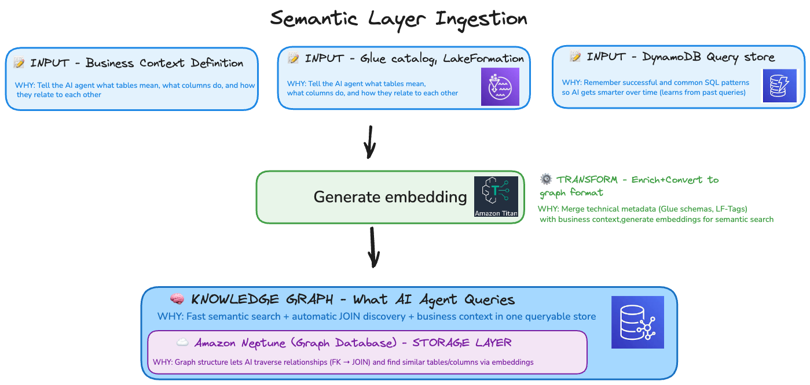

# Agentic Data Onboarding Platform

A multi-agent data pipeline platform that autonomously onboards datasets through **Bronze → Silver → Gold** zones using AI-driven orchestration and AWS services.

---

## How It Works

A user describes their data source in natural language. The **Data Onboarding Agent** coordinates specialized sub-agents to generate a complete, tested pipeline — config files, transformation scripts, quality checks, and an Airflow DAG — without writing any code manually.

```
User: "Onboard customer data from PostgreSQL, daily refresh, PII masking required"

   ┌─────────────────────────────────────────────────────────┐
   │  Data Onboarding Agent (orchestrator)                   │
   │                                                         │
   │  Phase 0: Health Check ─ verify AWS + MCP servers       │
   │  Phase 1: Discovery ─── asks source, schema, rules      │
   │  Phase 2: Dedup ─────── checks existing workloads       │
   │  Phase 3: Profile ───── samples data, detects PII       │
   │  Phase 4: Build ─────── spawns sub-agents:               │
   │     ├── Metadata Agent ──────→ config/ + catalog         │
   │     ├── Transformation Agent → scripts/ + sql/           │
   │     ├── Quality Agent ───────→ quality rules + gates     │
   │     ├── DAG Agent ───────────→ dags/ + schedule          │
   │     └── Code Validator ──────→ syntax + best practices   │
   │                                                         │
   │  Each sub-agent writes tests → must pass before next     │
   │  Code validation blocks deployment if errors found       │
   └─────────────────────────────────────────────────────────┘

Output: workloads/{dataset_name}/   (ready to deploy to MWAA)
```

---

## Architecture

### System Overview


### Pipeline Flow (Phase 0 → Phase 5)


### Data Zones (Medallion Pattern)

| Zone | Purpose | Format | Quality Gate |
|------|---------|--------|--------------|
| **Bronze** | Raw, immutable ingestion | Source format (CSV, JSON, Parquet) | None |
| **Silver** | Cleaned, validated, schema-enforced | Apache Iceberg on S3 Tables | Score >= 80% |
| **Gold** | Curated, business-ready | Iceberg (star schema or flat) | Score >= 95% |

### Agent Architecture (4 Main Agents)

| Agent | Purpose | When to Run | Folder |
|-------|---------|-------------|--------|
| **Environment Setup** | Set up AWS infra (IAM, S3, KMS, Glue, Gateway) | Once per AWS account | [`prompts/environment-setup-agent/`](prompts/environment-setup-agent/) |
| **Data Onboarding** | Orchestrate Bronze→Silver→Gold pipeline creation | Per data source (repeatable) | [`prompts/data-onboarding-agent/`](prompts/data-onboarding-agent/) |
| **Data Analysis** | Query semantic layer, create dashboards | On-demand after onboarding | [`prompts/data-analysis-agent/`](prompts/data-analysis-agent/) |
| **DevOps** | CI/CD, monitoring, cost optimization | Continuous (coming Q2-Q3 2026) | [`prompts/devops-agent/`](prompts/devops-agent/) |

**Sub-agents** (spawned by Data Onboarding Agent):
- **Metadata Agent**: Profile data schema, detect PII, generate semantic metadata
- **Transformation Agent**: Generate PySpark ETL scripts (Bronze→Silver→Gold)
- **Quality Agent**: Define quality rules, implement validation gates
- **Orchestration Agent**: Generate Airflow DAG with task dependencies

Sub-agents generate code/config only. AWS execution happens via MCP tools in main conversation.

### AWS Services

| Service | Purpose |
|---------|---------|
| S3 + S3 Tables | Data lake storage (Bronze/Silver/Gold zones) |
| AWS Glue | ETL jobs, crawlers, Data Catalog |
| Amazon Athena | SQL queries on Iceberg tables |
| Apache Iceberg | Table format (ACID, time-travel, schema evolution) |
| AWS KMS | Encryption at rest (zone-specific keys) |
| Lake Formation | Column-level security via LF-Tags |
| Amazon MWAA | Airflow orchestration |
| SageMaker Catalog | Business metadata (custom columns) |
| Amazon Neptune | Knowledge graph with Titan embeddings for semantic search |

### Semantic Layer

The semantic layer enables natural language to SQL query generation by combining business context (semantic.yaml) with technical metadata (Glue Catalog, Lake Formation) in a queryable graph database.



**How it works:**
1. **Input**: Define business context in `semantic.yaml` (column roles, aggregations, relationships, business terms)
2. **Transform**: Merge with Glue schemas and LF-Tags, generate 1024-dim Titan embeddings for tables/columns/terms/queries
3. **Storage**: Load into **Amazon Neptune** (graph with embeddings) + **SynoDB** (DynamoDB query patterns with embeddings)
4. **Query**: AI agent uses semantic search + graph traversal to auto-generate SQL with JOINs

**Why two stores?**
- **Neptune**: Graph relationships let AI discover JOINs via FK edges, semantic search finds similar tables/columns
- **SynoDB**: Fast key-value lookup for past query patterns, learns from successful queries over time

See [shared/semantic_layer/README.md](shared/semantic_layer/README.md) for detailed implementation.

### MCP Servers (Model Context Protocol)

13 MCP servers provide Claude Code with direct AWS access — no CLI needed for most operations. Pre-configured in `.mcp.json`, auto-install via `uvx` on first use.

**PyPI Servers (9)** — installed automatically via `uvx`:

| Server | Package | Purpose |
|--------|---------|---------|
| `core` | awslabs-core-mcp-server | S3 operations, KMS key management, Secrets Manager |
| `iam` | awslabs-iam-mcp-server | Role lookup, permission simulation, policy management |
| `lambda` | awslabs-lambda-mcp-server | Lambda invocation, Lake Formation grants via Lambda |
| `s3-tables` | awslabs-s3-tables-mcp-server | S3 Tables (Iceberg) management |
| `cloudtrail` | awslabs-cloudtrail-mcp-server | Audit trail verification, compliance checks |
| `redshift` | awslabs-redshift-mcp-server | Schema verification, Gold zone queries via Spectrum |
| `cloudwatch` | awslabs-cloudwatch-mcp-server | Logs, metrics, alarms |
| `cost-explorer` | awslabs-cost-explorer-mcp-server | Cost tracking, budget analysis |
| `dynamodb` | awslabs-dynamodb-mcp-server | DynamoDB / SynoDB operations |

**Custom Servers (4)** — built in-house using FastMCP, in `mcp-servers/`:

| Server | Tools | Purpose |
|--------|-------|---------|
| `glue-athena` | 13 | Glue catalog CRUD, crawler management, ETL job execution, synchronous Athena queries |
| `lakeformation` | 9 | LF-Tag create/apply/remove, TBAC grant/revoke, column-level security |
| `sagemaker-catalog` | 5 | Business metadata (column roles, PII flags, hierarchies) on Glue tables |
| `pii-detection` | 6 | AI-driven PII detection + automatic LF-Tag application |

**Quick start** (after cloning):
```bash
# Prerequisites: uv installed, AWS credentials configured
claude mcp list   # All 13 servers auto-connect
```

**Health check before deployment**: 3 servers are REQUIRED (`glue-athena`, `lakeformation`, `iam`) -- deployment blocks if any fail. See [MCP_SETUP.md](MCP_SETUP.md) for full setup guide.

### Agentcore (Optional Cloud Deployment)

All 13 MCP servers can be deployed to **Agentcore Gateway** for shared, cloud-hosted tool access -- no local Python, uv, or stdio transport needed per user. The **Data Onboarding Agent** can be deployed to **Agentcore Runtime** for API-accessible invocation, with all 13 tools connected from Gateway.

```
Local Mode (default)           Agentcore Mode
────────────────────           ────────────────────────
Claude Code → stdio → 13      Claude Code / API Client
  local servers                    → Runtime (agent)
                                       → Gateway (all 13 servers)
```

- Deploy Gateway (all 13 servers): `prompts/environment-setup-agent/deploy-agentcore-gateway.md`
- Deploy Runtime (agent + Gateway tools): `prompts/environment-setup-agent/deploy-agentcore-runtime.md`
- Config + 13 IAM policies: `prompts/environment-setup-agent/agentcore/`

See [prompts/environment-setup-agent/agentcore/README.md](prompts/environment-setup-agent/agentcore/README.md) for details.

---

## Project Structure

```
.
├── workloads/                        # Onboarded datasets (one folder per dataset)
│   ├── sales_transactions/           # Example: e-commerce sales
│   ├── customer_master/              # Example: customer data with KMS + PII
│   ├── order_transactions/           # Example: orders with star schema + FK
│   ├── product_inventory/            # Example: inventory with quality checks
│   ├── us_mutual_funds_etf/          # Example: mutual funds (most complete)
│   ├── healthcare_patients/          # Example: HIPAA compliance (deployed to MWAA)
│   └── financial_portfolios/         # Example: SOX compliance (deployed to MWAA)
│
├── shared/                           # Reusable code across workloads
│   ├── reic/                         # REIC intent classification (vector search + agent selection)
│   ├── utils/                        # pii_detection, quality_checks, encryption
│   ├── policies/                     # Cedar policies (guardrails + authorization)
│   ├── mcp/                          # MCP orchestrator + custom servers
│   ├── fixtures/                     # Shared test fixtures (CSV stubs)
│   └── templates/                    # Templates for new workloads
│
├── demo/                             # Demo/testing resources (not production)
│   ├── data_generators/              # Synthetic data scripts
│   ├── sample_data/                  # Pre-generated CSV files
│   ├── orchestrator_examples/        # Multi-workload DAG examples
│   └── workflows/                    # Demo governance workflows
│
├── mcp-servers/                      # Custom MCP servers (4 FastMCP servers with SSE support)
├── sample_data/                      # Sample CSV files for sales_transactions
├── docs/                             # Setup guides and architecture docs
├── prompts/                          # Agent-based prompt organization
│
│   ├── environment-setup-agent/      # One-time AWS infrastructure setup (includes agentcore/ config)
│   ├── data-onboarding-agent/        # Bronze→Silver→Gold pipeline creation (main workflow)
│   ├── data-analysis-agent/          # Dashboards, queries via semantic layer
│   ├── devops-agent/                 # CI/CD, monitoring (coming soon)
│   └── examples/                     # Demo data generation helpers
├── CLAUDE.md                         # Agent configuration and conventions
├── SKILLS.md                         # Agent skill definitions and prompts
├── TOOL_ROUTING.md                   # Which tool to pick (read first)
├── TOOLS.md                          # AWS service mapping per agent phase
├── MCP_GUARDRAILS.md                 # MCP tool selection rules
├── WORKFLOW.md                       # Visual workflow diagrams
├── MCP_SETUP.md                      # MCP server configuration guide
├── SECURITY.md                       # Security practices and sanitization
├── RUNNING_TESTS.md                  # Test execution guide
├── conftest.py                       # Pytest configuration
└── pyproject.toml                    # Python project config
```

### Workload Structure (generated per dataset)

```
workloads/{dataset_name}/
├── config/
│   ├── source.yaml                   # Connection details, format, frequency
│   ├── semantic.yaml                 # Column roles, business context, PII flags
│   ├── transformations.yaml          # Cleaning rules, Gold zone schema
│   ├── quality_rules.yaml            # Thresholds, critical rules
│   └── schedule.yaml                 # Cron, dependencies, failure handling
├── scripts/
│   ├── extract/                      # Ingestion from source to Bronze
│   ├── transform/                    # Bronze→Silver→Gold (PySpark + local mode)
│   ├── quality/                      # Quality check execution
│   └── load/                         # Catalog registration
├── dags/
│   └── {dataset_name}_dag.py         # Airflow DAG (independent per workload)
├── sql/
│   ├── bronze/                       # DDL for raw tables
│   ├── silver/                       # DDL for cleaned tables
│   └── gold/                         # DDL for curated tables
├── tests/
│   ├── unit/                         # Self-contained tests (no dependencies)
│   └── integration/                  # Tests requiring pipeline output
└── README.md
```

---

## Getting Started

### Prerequisites

- Python 3.9+
- AWS account with Glue, Athena, S3, MWAA configured
- Claude Code CLI

### Run Tests Locally

```bash
# Install dependencies
pip install -r requirements.txt

# Run all tests (no AWS required)
pytest workloads/ -v

# Run specific workload
pytest workloads/sales_transactions/tests/ -v

# Unit tests only (no prerequisites)
pytest workloads/*/tests/unit/ -v
```

See [RUNNING_TESTS.md](RUNNING_TESTS.md) for complete test guide including data generation.

### Onboard a New Dataset

Using Claude Code, describe your data source:

```
"Onboard customer_orders from our PostgreSQL database.
 Daily refresh at 6 AM UTC. Contains PII (email, phone).
 Need star schema in Gold zone for reporting dashboards."
```

The agent will:
1. Ask clarifying questions (schema, cleaning rules, quality thresholds)
2. Check for duplicate sources in existing workloads
3. Profile a sample of your data
4. Generate all pipeline artifacts with tests
5. Present artifacts for your approval before writing

### Deploy to AWS

```bash
# Upload workload to MWAA S3 bucket
aws s3 sync workloads/{dataset}/ s3://{mwaa-bucket}/dags/workloads/{dataset}/
aws s3 sync shared/ s3://{mwaa-bucket}/dags/shared/

# The workload's DAG will appear in MWAA Airflow UI
```

See [docs/aws-account-setup.md](docs/aws-account-setup.md) for AWS configuration details.

---

## Key Features

### PII Detection and Governance
- AI-driven detection of 12 PII types (EMAIL, PHONE, SSN, CREDIT_CARD, etc.)
- Lake Formation LF-Tags for column-level access control
- 4 sensitivity levels: CRITICAL, HIGH, MEDIUM, LOW
- Integrated into profiling phase — runs automatically on every dataset
- **Regulation-specific prompts** for GDPR, CCPA, HIPAA, SOX, PCI DSS — see [prompts/data-onboarding-agent/regulation/](prompts/data-onboarding-agent/regulation/). Each prompt contains self-contained controls (retention, masking, LF-Tags, TBAC grants, audit, quality rules) applied only when a regulation is selected during discovery

### Quality Gates
- 5 dimensions: Completeness, Accuracy, Consistency, Validity, Uniqueness
- Critical rule failures block zone promotion regardless of overall score
- Anomaly detection for outliers, distribution shifts, volume changes
- Historical comparison against baseline

### Cedar Policy Guardrails
- 16 forbid policies preventing unsafe operations (e.g., Bronze mutation, quality bypass)
- 7 agent authorization policies controlling which agent can do what
- Dual-mode: local evaluation (cedarpy) or AWS Verified Permissions

### REIC: RAG-Enhanced Intent Classification
Inspired by the REIC research paper on improving intent routing for multi-agent systems:

- **Problem**: The Router Agent used exact string matching — "CRM data" wouldn't find `customer_master` because the words don't literally match
- **Solution**: Vector similarity search (TF-IDF with FAISS upgrade path) over workload metadata — compares *meaning*, not exact strings
- **How it works**: Reads every workload's `source.yaml` + `semantic.yaml`, extracts keywords (column names, descriptions, tags, business terms), and builds a searchable index. Incoming intents are scored against all workloads using cosine similarity.
- **3-level hierarchical routing**: Phase (discovery/build/deploy) → Agent (constrained by phase) → Action (specific operation) — each level uses softmax probabilities for deterministic, ranked selection
- **No heavy dependencies**: Real ML embeddings (sentence-transformers + FAISS) are optional. Falls back to TF-IDF (stdlib only, no installs). Set `REIC_ENABLED=false` to disable entirely — existing routing still works.
- **74 tests** validating determinism, confidence bounds, phase constraints, and end-to-end intent classification

```
# Before REIC                          # After REIC
User: "CRM data"                       User: "CRM data"
→ grep for "CRM data"                  → TF-IDF similarity search
→ no match                             → customer_master (score: 0.82)
→ "not onboarded" (wrong)              → "Found customer_master" (correct)
```

### Deep Agent Tracing (Three-Layer Observability)
Inspired by the **AgentTrace** research paper (Gao et al., 2025) on debugging and understanding multi-agent systems, adapted for our LLM sub-agent architecture where you cannot instrument agent reasoning externally.

**Problem**: Traditional agent tracing assumes Python classes you can wrap with decorators. Our agents are Claude Code LLM sub-agents (prompt templates in SKILLS.md) — their reasoning is a black box.

**Solution**: Three instrumentable layers, linked by `run_id` + `parent_span_id`:

| Layer | What It Captures | How |
|-------|-----------------|-----|
| **1. Orchestrator** | Phase transitions, test gates, retries, span hierarchy | `OrchestratorLogger` + `AgentTracer` (Python, fully instrumentable) |
| **2. Generated Scripts** | Row counts, transforms applied, quality scores, errors | `StructuredLogger` wired into Glue ETL scripts |
| **3. LLM Self-Reporting** | Reasoning, alternatives considered, rejection reasons, confidence | `AgentOutput.decisions[]` array (prompt engineering, not instrumentation) |

**Three-surface event model** (from AgentTrace): Every trace event is classified as **operational** (what happened), **cognitive** (why it happened), or **contextual** (what surrounded it). This lets you filter traces by concern — debugging failed pipelines vs. understanding agent decisions vs. correlating across workloads.

**OTel-compatible fields**: ~15 fields per event (slimmed from AgentTrace's 30+ to only fields we can actually populate — no token counts from Claude Code sub-agents). Output is JSONL, parseable by jq, CloudWatch, Splunk.

**CLI viewer** (`shared/logging/trace_viewer.py`): `--summary`, `--decisions`, `--timeline`, `--failures`, `--export-md` (narrative), `--export-map` (decision tree).

```
# View agent reasoning for a pipeline run
python3 -m shared.logging.trace_viewer trace_events.jsonl --decisions

  [1] schema_inference — Metadata Agent (phase 4)
      Reasoning: CSV headers suggest financial data. ticker is PK, current_price is decimal.
      Choice:    12 columns: 2 identifiers, 6 measures, 3 dimensions, 1 temporal
      Confidence: high

  [2] transformation_choice — Transformation Agent (phase 4)
      Reasoning: Dedup by ticker, type-cast to decimal, validate positive prices.
      Alternatives: dedup by composite key (rejected: no date column for freshness)
      Confidence: high
```

### Deterministic Agent Output
Inspired by the **GCC (Guardrails, Cognitive traces, Checksums)** pattern for making LLM-based multi-agent systems reproducible and auditable:

- **Input/Output Hashing**: SHA-256 checksums on all inputs and generated artifacts. Same inputs must produce identical outputs — verified by comparing hashes across runs.
- **Ordered Outputs**: Dictionary keys sorted alphabetically, lists sorted by stable keys (column name, rule_id). Deterministic YAML serialization via `shared/utils/deterministic_yaml.py`.
- **Fixed Timestamps**: Generated artifacts use run start time (`started_at`), not `datetime.now()`, preventing timestamp drift between identical runs.
- **Seeded Randomness**: Any randomness uses `random_seed` from run context. Never `random()` without a seed.
- **Idempotency Checks**: Before writing any file — same checksum skips, different checksum overwrites + logs diff, missing file creates.
- **Template Versioning**: Every generated file includes a header with agent name, template version, and input hash for traceability.
- **Cognitive Traces**: Every sub-agent must include a `decisions[]` array documenting every significant choice, alternatives considered, and rejection reasons — making LLM "thinking" auditable.

### Cedar Policy Guardrails
Uses **Amazon Cedar** (the policy language behind Amazon Verified Permissions) to enforce safety invariants across the pipeline — 23 policies total:

**16 Forbid Policies** (guardrails — things that must NEVER happen):
| Category | Policies | Examples |
|----------|----------|---------|
| **Data Quality** (4) | Quality gate thresholds, no critical failures, no silent row drops, row count range checks | `dq_001`: Silver requires score >= 0.80, Gold >= 0.95 |
| **Security** (4) | KMS key validation, PII masking, TLS enforcement, credential protection | `sec_003`: PII columns must be masked in logs and query results |
| **Integrity** (4) | Landing/Bronze immutability, FK integrity, derived column formulas, schema enforcement | `int_001`: Bronze zone data is NEVER modified after ingestion |
| **Operations** (4) | Idempotency, encryption re-keying at zone boundaries, audit log immutability, Iceberg metadata | `ops_001`: Running a transform twice must produce identical output |

**7 Agent Authorization Policies** (who can do what):
Each agent (Router, Onboarding, Metadata, Transformation, Quality, DAG, Analysis) has a Cedar permit policy defining exactly which actions it can perform on which resources — enforcing least-privilege at the agent level.

**Dual-mode evaluation**: `shared/utils/cedar_client.py` evaluates policies locally (cedarpy) for testing or via AWS Verified Permissions (boto3) for production. Setup script at `prompts/environment-setup-agent/scripts/setup_avp.py` syncs all policies to AVP.

### Test-Driven Pipeline Generation
- Every sub-agent writes unit + integration tests alongside artifacts
- Tests must pass before the orchestrator proceeds (max 2 retries)
- 728+ passing tests across 7 workloads, all runnable locally without AWS

### Pre-Deployment Code Validation (Step 4.5.1)
Automatically validates all generated code BEFORE deployment to catch 95% of issues in seconds vs. minutes of MWAA debugging:

**5 validation checks** (fail-fast):
1. **Python syntax**: All scripts compile without errors (`py_compile`)
2. **DAG parsing**: Airflow can import the DAG file without exceptions
3. **Import resolution**: All `from X import Y` statements resolve
4. **Airflow best practices**: 8 patterns enforced (context manager, retries, no hardcoded paths, etc.)
5. **YAML syntax**: All config files parse correctly

**Auto-fix policy**: Errors are fixed inline (max 2 attempts), no human intervention for syntax errors

**Why it matters**: MWAA takes 1-2 minutes to refresh DAGs after S3 upload. A parsing error blocks ALL DAGs from loading. This step prevents wasted deployment cycles.

---

## Example Workloads

| Workload | Tests | Status | Key Features |
|----------|-------|--------|-------------|
| `sales_transactions` | 196 | Local | Basic Bronze→Silver→Gold, quality checks |
| `customer_master` | 118 | Local | KMS encryption, PII masking, Iceberg tables |
| `order_transactions` | 70 | Local | FK validation, star schema, aggregate calculations |
| `product_inventory` | 23 + 18* | Local | Advanced quality rules, quarantine handling |
| `us_mutual_funds_etf` | 321 + 44* | Deployed | PII detection, QuickSight dashboards, MWAA DAG |
| `financial_portfolios` | 200+ | Deployed | SOX compliance, 7 Iceberg tables, MWAA DAG |
| `healthcare_patients` | Generated | Deployed | HIPAA compliance, PHI masking, TBAC, MWAA DAG |

*Some tests require PySpark (Java) or pipeline output to be generated first. See [RUNNING_TESTS.md](RUNNING_TESTS.md).

---

## Documentation

| Document | Purpose |
|----------|---------|
| [CLAUDE.md](CLAUDE.md) | Agent configuration, security rules, data zone rules |
| [SKILLS.md](SKILLS.md) | Agent skill definitions, spawn prompts, workflows |
| [TOOL_ROUTING.md](TOOL_ROUTING.md) | **Read first** — which tool to pick and why (intent-based) |
| [TOOLS.md](TOOLS.md) | AWS service mapping per pipeline phase (how to use each tool) |
| [MCP_GUARDRAILS.md](MCP_GUARDRAILS.md) | MCP tool selection rules per phase (actual tool names) |
| [WORKFLOW.md](WORKFLOW.md) | Visual workflow and data flow diagrams |
| [MCP_SETUP.md](MCP_SETUP.md) | MCP server configuration |
| [SECURITY.md](SECURITY.md) | Security practices |
| [RUNNING_TESTS.md](RUNNING_TESTS.md) | Test execution guide |
| [docs/aws-account-setup.md](docs/aws-account-setup.md) | AWS prerequisites |
| [prompts/environment-setup-agent/agentcore/README.md](prompts/environment-setup-agent/agentcore/README.md) | Agentcore Gateway + Runtime (optional) |
| [docs/getting-started.md](docs/getting-started.md) | Quick start guide |

---

## Technology Stack

- **Language**: Python (Glue PySpark + Airflow DAGs)
- **Table Format**: Apache Iceberg (ACID, time-travel, schema evolution)
- **Orchestration**: Apache Airflow (MWAA)
- **Cloud**: AWS (S3, Glue, Athena, Lake Formation, KMS, MWAA)
- **Testing**: pytest (unit + integration, property-based with fast-check)
- **Intent Routing**: REIC (TF-IDF / FAISS vector similarity + hierarchical classification)
- **Policy Engine**: Cedar (23 policies via Amazon Verified Permissions)
- **Agent Tracing**: AgentTrace-inspired three-layer observability (OTel-compatible JSONL)
- **Determinism**: GCC pattern (guardrails + cognitive traces + checksums)
- **AI Integration**: MCP (Model Context Protocol) for standardized AWS access

---

## Data Security

The platform enforces security at every layer:

- **Encryption**: AES-256 at rest (zone-specific KMS keys), TLS 1.3 in transit, re-encryption at zone boundaries
- **PII Detection**: Automatic AI-driven scanning of all columns (name-based + content-based patterns) — see `shared/utils/pii_detection_and_tagging.py`
- **Column-Level Access**: Lake Formation LF-Tags (`PII_Classification`, `PII_Type`, `Data_Sensitivity`) enable tag-based access control (TBAC) — analysts see only what their role permits
- **Regulatory Compliance**: Self-contained prompt per regulation in [prompts/data-onboarding-agent/regulation/](prompts/data-onboarding-agent/regulation/):
  - **GDPR** — right to erasure, consent tracking, 365-day retention, data minimization
  - **CCPA** — right to know/delete, opt-out tracking, 730-day retention, data lineage
  - **HIPAA** — PHI encryption, minimum necessary access, BAA, 7-year audit trail
  - **SOX** — financial integrity, 0.95+ quality gates, immutable Bronze, 7-year retention
  - **PCI DSS** — cardholder data tokenization, CVV drop, restricted `pci_admin_role` access
- **Cedar Policies**: 16 forbid policies + 7 agent authorization policies enforcing safety invariants (no Bronze mutation, no quality bypass, PII masking in logs)
- **Audit Logging**: CloudTrail for all Lake Formation operations — who accessed what column, when tags changed, all permission grants
- **Bronze Immutability**: Source data is never modified after ingestion

See [SECURITY.md](SECURITY.md) and [CONTRIBUTING](CONTRIBUTING.md#security-issue-notifications) for more information.

## License

This project is licensed under the MIT-0 License. See the [LICENSE](LICENSE) file for details.
