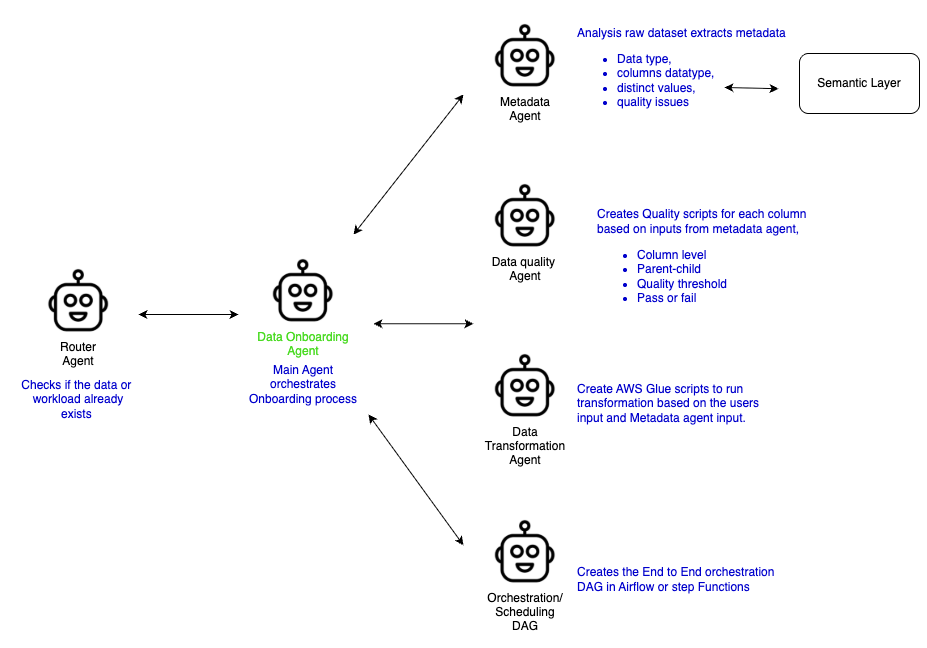
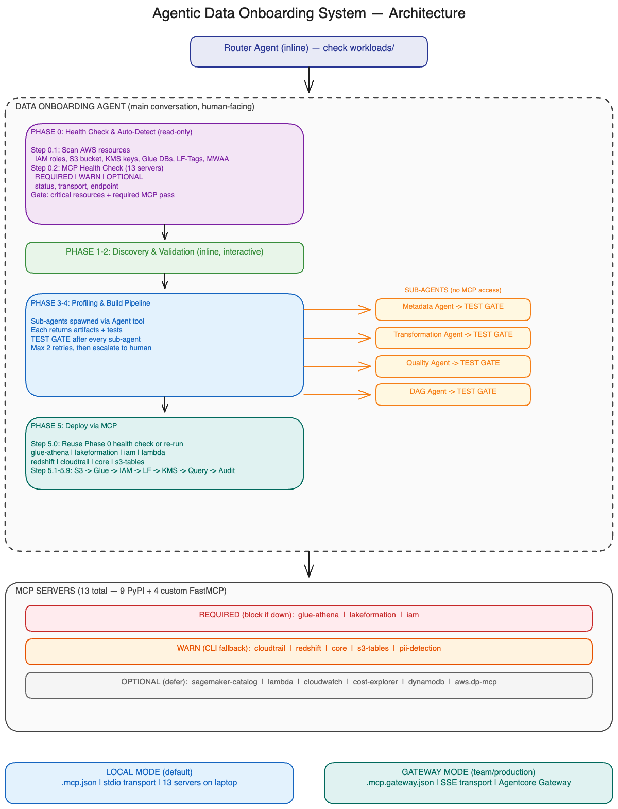

# Agentic Data Onboarding Platform

**Automate your entire data operations pipeline** — ETL, data quality, semantic layer population, and data analysis — **reducing development time from weeks to hours.** Built-in compliance with **GDPR, CCPA, HIPAA, SOX, and PCI DSS** through regulation-specific prompts that automatically apply required controls.

---

## Starting the Agent

Open Claude Code in this repo and paste a prompt describing **where the data lives, where it's going, the cadence, and any compliance requirements.** The Data Onboarding Agent asks clarifying questions, then spawns sub-agents to generate a fully tested workload under `workloads/<name>/`.

**A good prompt includes:**
- **Source** (S3 path / Kafka topic / Kinesis stream / JDBC)
- **Sink cadence** (batch daily / micro-batch / streaming)
- **Target zones** (Silver quality rules, Gold transformations)
- **Compliance** (GDPR, CCPA, HIPAA, SOX, PCI DSS — or none)

### Example 1 — Batch from S3 (CSV, daily)
```
Onboard claims data from s3://data-lake-<account>-us-east-1/bronze/claims/ingestion_date=YYYY-MM-DD/claims.csv
into Silver with dedup on claim_id and not-null policy_number, and into a flat denormalized
Gold Iceberg table with derived measures (net_paid_ratio, days_to_submission, denial_category).
Run daily at 03:00 UTC. Apply HIPAA controls with PHI masking in Silver and PHI suppression in Gold.
```

### Example 2 — Streaming from Kafka (Glue Streaming ETL)
```
Onboard transaction events from Kafka topic `payments.auth.v1` (bootstrap:
b-1.msk-prod.kafka.us-east-1.amazonaws.com:9098, IAM auth) using AWS Glue Streaming ETL.
Land micro-batches every 60s into Bronze Iceberg on S3, dedup on event_id in Silver
with schema validation, and aggregate to 5-minute windows in Gold (fraud_score by merchant, rolling
auth_rate). Apply PCI DSS — tokenize PAN, drop CVV, Luhn check as a quality rule.
```

### Example 3 — Streaming from Kinesis (Glue Streaming ETL)
```
Onboard clickstream events from Kinesis Data Stream `web-events-prod` (shard count 8,
PutRecord enhanced fan-out consumer) using AWS Glue Streaming ETL with a checkpoint on S3.
Write Bronze Iceberg on 1-minute triggers, Silver with session stitching on user_id + 30-min
inactivity gap, Gold hourly rollups (page_views, unique_users, bounce_rate by traffic_source).
Apply GDPR — consent-based filter on user_id, 365-day retention, right-to-erasure hook.
```

### Prompt Depth: Brief vs. Detailed

You can be brief or detailed — the agent asks clarifying questions either way. Here's the same dataset at two levels of detail:

**High-level** (agent fills in defaults, keeps moving):
```
Onboard e-commerce orders from s3://your-landing-bucket/ecommerce_orders/

- CSV, 50 rows, GDPR, daily 09:30 UTC batch
- Gold: flat denormalized table for ad-hoc queries (no star schema)
- DQ: completeness > 85%, validate dates/emails/phones, quarantine bad rows
- Transforms: mask credit cards, standardize phones, cast dates, derive order_month + days_to_ship

Print a status box after each phase. Don't ask questions — use defaults and keep moving.
```

**Deep-dive** (fully specified, no questions needed):
```
Onboard a new e-commerce orders dataset.

Source:
- Location: s3://your-landing-bucket/ecommerce_orders/
- Format: CSV, 50 rows, batch ingestion
- Refresh: Daily at 09:30 UTC

Compliance: GDPR
- PII columns: customer_email, customer_phone, credit_card_number, customer_name, shipping_address
- Require consent tracking, right-to-erasure support, 365-day retention

Gold Zone: Flat denormalized table for ad-hoc analytics (NO star schema)

Data Quality Rules:
- Completeness threshold: 85% (block promotion if below)
- Validate order_date format (reject invalid dates like month > 12)
- Validate customer_email format (must contain @)
- Validate customer_phone format (reject non-numeric junk)
- Flag invalid credit_card_number values
- Flag rows missing city/state/zip as incomplete
- Anomaly: flag orders where total_amount != quantity × unit_price × (1 - discount_pct)

Transformations (Bronze → Silver):
- Standardize phone to E.164 format
- Mask credit_card_number (show last 4 only: ****-****-****-1234)
- Cast order_date and ship_date to DATE type
- Trim whitespace on all string columns
- Quarantine rows with invalid dates (don't drop silently)

Transformations (Silver → Gold):
- Flatten all columns into single wide table
- Add derived columns: order_month, days_to_ship, is_returned, is_high_value (total > $100)
- Keep only delivered + returned orders (exclude processing/cancelled)

Schedule: Daily batch at 09:30 UTC, retries=3, exponential backoff, alert on failure
```

Watch the agent run, approve the plan it presents, and the artifacts land under `workloads/<name>/` (config, scripts, DAG, tests, ontology).

---

## Why Agentify Data Operations?

Traditional data pipeline development is slow, manual, and error-prone:
- **Weeks of manual coding** for ETL scripts, quality checks, and orchestration DAGs
- **Repetitive boilerplate** across similar data sources (CSV ingestion patterns, PII detection, quality rules)
- **Knowledge scattered** across Confluence docs, Slack threads, and tribal knowledge
- **Quality issues discovered in production** instead of during development

**This platform agentifies the entire data operations workflow:**

| Traditional Approach | Agentic Approach | Time Saved |
|---------------------|------------------|------------|
| Data engineer writes PySpark ETL (2-3 days) | **Data Onboarding Agent** generates Bronze→Silver→Gold scripts from natural language (15 minutes) | **95%** |
| Manually create quality rules per column (1-2 days) | **Data Quality Agent** auto-generates column-level checks from profiling (10 minutes) | **90%** |
| Write Airflow DAG with task dependencies (1 day) | **Orchestration Agent** generates tested DAG from schedule config (15 minutes) | **95%** |
| Author OWL ontology + R2RML mappings by hand (1-2 weeks) | **Ontology Staging Agent** induces OWL + R2RML from `semantic.yaml` + Glue (10 minutes) | **99%** |
| Debug recurring pipeline failures (ongoing) | **Prompt Intelligence Agent** learns from failures, prevents recurrence (automated) | **Hours per week** |

**Result: Data pipeline development goes from 2-3 weeks → 2-3 hours.**

---

## How It Works

**Built for Claude Code, adaptable to other AI assistants.** While this platform is designed for **Claude Code** (CLI, Desktop, Web), the prompt architecture and agent workflows can be adapted with slight modifications to work with **Kiro**, **GitHub Copilot**, **Cursor**, or other AI coding assistants that support context-aware code generation.

**All agents run in the Development environment only.** Generated scripts and configurations are version-controlled and promoted to higher environments (QA, Staging, Production) through standard CI/CD pipelines. Agents do not run in production — only the artifacts they generate.

---

## 1. Data Onboarding Agent

**Purpose:** Automates the entire Bronze→Silver→Gold pipeline creation process from a natural language description.

**Runs in:** Development environment only
**Output:** Version-controlled scripts, configs, DAGs, and tests → promoted to higher environments via CI/CD

A user describes their data source in natural language. The **Data Onboarding Agent** coordinates specialized sub-agents to generate a complete, tested pipeline — config files, transformation scripts, quality checks, and an Airflow DAG — without writing any code manually.

### Agent Coordination Workflow



**The Data Onboarding Agent (center) orchestrates specialized sub-agents. The Router Agent gates entry on the left; Glue Catalog, Semantic Layer (OWL/SHACL), Decision Engine, Memory, and Agentrace logs are shared services on the right.**

1. **Router Agent** — Checks if the data or workload already exists in `workloads/`
2. **Metadata Agent** — Analyzes raw dataset, extracts metadata (data types, column datatypes, distinct values, quality issues), stores business context in **Semantic Layer**
3. **Ontology Agent** — Induces the OWL ontology for the Semantic Layer from Glue/SageMaker Catalog metadata (data types, column datatypes, distinct values, quality issues)
4. **Data Quality Agent** — Creates quality scripts for each column based on metadata agent inputs (column-level checks, parent-child relationships, quality thresholds, pass/fail gates)
5. **Data Transformation Agent** — Creates AWS Glue scripts to run transformations (Bronze→Silver→Gold) based on user input and metadata agent analysis
6. **Orchestration/Scheduling DAG Agent** — Creates the end-to-end orchestration DAG in Airflow or Step Functions
7. **DevOps Agent** — Creates CloudFormation, Terraform, and AWS CDK to promote the generated artifacts to higher environments

**Workflow:**
```
User: "Onboard customer data from PostgreSQL, daily refresh, PII masking required"

Phase 0: Health Check ─ verify AWS resources + 13 MCP servers (REQUIRED/WARN/OPTIONAL)
Phase 1: Discovery ─── asks source, schema, cleaning rules, quality thresholds, schedule
Phase 2: Dedup ─────── checks existing workloads for overlaps, reuses shared assets
Phase 3: Profile ───── samples 5% of data, detects PII, presents metadata for approval
Phase 4: Build ─────── spawns 4 sub-agents → each writes artifacts + tests → TEST GATE
Phase 4.5: Validate ── checks Python syntax, DAG parsing, imports, Airflow best practices
Phase 5: Deploy ────── uploads to S3, creates Glue catalog, applies LF-Tags, verifies

Output: workloads/{dataset_name}/ with config/, scripts/, dags/, sql/, tests/
```

### Workload Memory (Persistent Learning)

Each workload maintains its own memory system in `workloads/{name}/memory/` that accumulates knowledge across pipeline runs — schema quirks, quality thresholds, operator preferences, and successful patterns — enabling future runs to start with context instead of cold discovery. When the same workload is re-processed, the agent loads this memory first, pre-filling known answers and avoiding repetitive questions, while continuously learning from new failures and successes to prevent recurring issues.

---

## 2. Ontology Staging Agent (AWS Semantic Layer Handoff)

**Purpose:** Induces an OWL ontology + R2RML mappings from each workload's `semantic.yaml` + Glue Catalog schema, staged locally for handoff to **AWS Semantic Layer** (upcoming AWS Semantic Layer platform, currently in development).

**Runs in:** Development environment only (emits files to `workloads/{name}/config/`)
**Output:** `ontology.ttl` (OWL2 classes/properties/hierarchy), `mappings.ttl` (R2RML linking classes to Glue tables), `ontology_manifest.json` (version, checksums, steward checklist)

**Scope boundary:** ADOP generates and validates Turtle locally. ADOP does **NOT** run T-Box reasoning, author SHACL constraints, or publish to a VKG — those are the Data Steward's responsibilities inside the AWS Semantic Layer platform when the AWS Semantic Layer platform deploys.

**How it works:**

1. **OWL induction** — `semantic.yaml` entities → owl:Class, dimension/measure/temporal columns → owl:DatatypeProperty with xsd ranges, relationships → owl:ObjectProperty (+ owl:FunctionalProperty for many-to-one), hierarchies → rdfs:subClassOf chain, PII flags → ex:piiClassification annotations, Glue-only columns → ex:autoInduced annotation.
2. **R2RML mapping** — one TriplesMap per entity, logical table = Athena SQL against the Gold zone, subject URI template = `http://semantic.aws/{namespace}/data/{ClassName}/{pk}`, FK columns emit `rr:parentTriplesMap` references.
3. **Turtle validation** — parse with `rdflib`, auto-fix common issues (unescaped quotes, missing semicolons), retry up to 2 times.
4. **Staging** — write 3 artifacts to `workloads/{name}/config/` with SHA-256 checksums and `"state": "STAGED_LOCAL"`. Data Steward picks these up for AWS Semantic Layer publish.

When the AWS Semantic Layer platform is deployed, a follow-up `ontology-publish-agent` (future) will read the committed TTL files and push them to Neptune SPARQL + S3 + DynamoDB + SNS.

---

## 3. Environment Setup Agent

**Purpose:** Automates one-time AWS infrastructure provisioning and MCP server deployment across local and cloud modes.

**Runs in:** Development environment only (one-time setup)
**Output:** AWS resources (S3, Glue, KMS, IAM), MCP server configurations, Agentcore Gateway/Runtime (optional)

The Environment Setup Agent handles the foundational infrastructure setup that must happen before any data onboarding can begin. This includes AWS resource provisioning (S3 buckets, KMS keys, Glue databases, Lake Formation settings), MCP server installation and health checks, and optional Agentcore Gateway deployment for shared cloud-hosted tool access.

---

## 4. Semantic Layer (Business Context + Ontology Handoff)

**Purpose:** Captures business context (column roles, dimension hierarchies, relationships, PII flags) in `semantic.yaml` and emits a formal OWL ontology + R2RML mappings for handoff to **AWS Semantic Layer** — the upcoming AWS Semantic Layer platform responsible for NL→SQL, reasoning, SHACL validation, and VKG publish.

**Runs in:** Development (config authoring + ontology induction)
**Output:** `workloads/{name}/config/semantic.yaml` (source of truth), `ontology.ttl` (OWL2), `mappings.ttl` (R2RML), `ontology_manifest.json`. All committed to git.

The semantic layer captures column roles (measures, dimensions, temporal, identifiers), hierarchical relationships (country→state→city), business terms, and PII classifications. **SageMaker Catalog** mirrors this on the Glue Data Catalog as custom metadata properties so downstream consumers see business context alongside technical schemas.

At Phase 7 Step 8.5 of the deploy flow, the **Ontology Staging Agent** induces an OWL ontology from `semantic.yaml` + the deployed Glue Gold table schema, generates R2RML mappings wiring each OWL class to its physical table, and validates Turtle syntax with rdflib. The resulting `ontology.ttl` + `mappings.ttl` + `ontology_manifest.json` land in `workloads/{name}/config/` for AWS Semantic Layer to pick up.

**Hard boundary:** ADOP stops at emission. AWS Semantic Layer (in development) owns SHACL authoring, T-Box reasoning (HermiT/ELK), VKG publish (Ontop), and NL→SQL runtime. When the AWS Semantic Layer platform deploys, a future publish agent will push the committed TTL files from local to Neptune SPARQL + S3 + DynamoDB + SNS — no regeneration needed because the inducer is deterministic.

---

## 5. Organizational Tool Decision Engine

**Purpose:** Dynamically selects the optimal tool for each operation based on organizational principles, available infrastructure, and real-time health status.

**Runs in:** All phases (continuous tool selection)
**Output:** Tool routing decisions, fallback strategies, organizational compliance reports

Tools are decided on-the-fly based on a hierarchical decision framework that can be configured per organization's principles and infrastructure constraints. The system maintains a live inventory of available MCP servers, CLI tools, and cloud services, then routes each operation to the most appropriate tool based on factors like performance requirements, security policies, cost optimization, and organizational preferences (e.g., "always use MCP over CLI when available" or "prefer Athena over Redshift for ad-hoc queries").

Organizations can define custom routing rules through policy files that specify tool preferences, security constraints (e.g., "PII operations must use designated KMS keys"), cost thresholds, and failover strategies. The decision engine evaluates these rules in real-time during pipeline execution, automatically falling back to alternative tools when primary choices are unavailable or violate organizational policies.

This enables the same pipeline code to run across different organizational environments — startups might default to cost-optimized tools while enterprises enforce security-first tool selection — without requiring separate implementations or manual configuration per deployment.

---

## 6. Prompt Intelligence Agent (Self-Healing)

**Purpose:** Learns from pipeline failures across all workloads and generates recommendations to prevent recurring issues.

**Runs in:** Development environment only
**Output:** Analysis reports with prompt patches, best practices, estimated time savings

The system **learns from mistakes** by analyzing trace logs from failed and successful pipeline runs across all workloads, then generates actionable recommendations to prevent recurring failures.

### What It Does

1. **Pattern Detection**: Scans `trace_events.jsonl` across all workloads to find recurring errors
2. **Cross-Workload Learning**: Groups identical failures (e.g., "KeyError: 'primary_key'" in 3+ workloads)
3. **Root Cause Analysis**: Explains why the pattern occurs (e.g., "CSV sources lack explicit PK column")
4. **Actionable Recommendations**: Generates ready-to-paste prompt patches to prevent recurrence
5. **Best Practice Extraction**: Identifies high-confidence decisions from successful runs

### When It Runs

- **Nightly (automated)**: `evolve` command analyzes traces, generates patches, and auto-grafts high-confidence fixes to SKILLS.md
- **Weekly (human review)**: Review pending patches (confidence 0.60-0.79) and approve or reject
- **On-demand**: After major failures or before deployments

```bash
# Self-healing loop: analyze → generate patches → auto-apply to SKILLS.md
python3 -m shared.prompt_intelligence.cli evolve --auto-graft --min-confidence 0.80

# Review pending patches
python3 -m shared.prompt_intelligence.cli patches --status pending

# Revert a bad patch
python3 -m shared.prompt_intelligence.cli prune --patch-id abc123

# Legacy: analysis-only (generates report, does not apply patches)
python3 -m shared.prompt_intelligence.cli analyze --all
```

**Example output:**
```
✓ Found 2 cross-workload failure patterns

Top Failure Patterns:
  1. KeyError: 'primary_key'
     Frequency: 3, Workloads: 3, Confidence: 0.78
     Impact: BLOCKING

Recommendation: For CSV sources, ALWAYS ask 'What is the primary key?'
                before profiling. Add to discovery checklist.

Estimated Time Saved: 10-15 hours across future onboardings
```

**Report includes:**
- **Executive Summary**: Impact distribution (BLOCKING/DEGRADED/MINOR), top blockers, estimated time savings
- **Failure Patterns**: Grouped by impact with root cause analysis and prompt patches (ready to copy-paste into prompt files)
- **Best Practices**: High-confidence successful decisions to adopt across workloads
- **Implementation Guide**: Step-by-step instructions for applying fixes

See [shared/prompt_intelligence/QUICKSTART.md](shared/prompt_intelligence/QUICKSTART.md) for 3-minute start guide.

---

## 7. DevOps Agent (Coming Q2 2026)

**Purpose:** Automates CI/CD, monitoring, cost optimization, and self-healing for deployed pipelines.

**Runs in:** Development environment (for CI/CD setup) AND Production (for monitoring/alerts)
**Output:** CI/CD pipelines, CloudWatch alarms, cost optimization recommendations, auto-remediation scripts

### Planned Features

- **CI/CD Pipelines** — Git push → auto-deploy to QA/Staging/Prod
- **Monitoring & Alerts** — Slack/email notifications for pipeline failures, quality degradation
- **Cost Optimization** — Identifies unused Glue crawlers, over-provisioned clusters, suggests S3 lifecycle policies
- **Self-Healing** — Auto-retries transient failures, scales resources based on data volume
- **Quality Drift Detection** — Alerts when data quality scores drop below historical baseline
- **Resource Scaling** — Right-sizes Glue jobs, Athena query concurrency based on usage patterns

**Status:** Design phase — implementation targeted for Q2 2026

---

## Environment Model: Dev-Only Agent Execution

**Critical principle:** All agents run **only in the Development environment**. Higher environments (QA, Staging, Production) execute only the generated scripts and configurations.

| Environment | What Runs | How |
|-------------|-----------|-----|
| **Development** | Active agents: Data Onboarding, Ontology Staging, Environment Setup, Prompt Intelligence. DevOps Agent planned for Q2 2026. | Interactive via Claude Code CLI |
| **QA/Staging** | Generated scripts/DAGs/configs only | Deployed via CI/CD (GitHub Actions, MWAA) |
| **Production** | Generated scripts/DAGs/configs only | Promoted via CI/CD after QA approval |

**Artifact Promotion Flow:**
```
Dev Agent → Generate scripts/tests → Commit to Git → CI/CD pipeline → QA → Staging → Prod
          ↓
      Run tests locally
      Validate syntax/best practices
      Human approval
```

**Why this matters:**
- **Security**: Agents don't need production AWS credentials
- **Auditability**: All changes are version-controlled, peer-reviewed
- **Reproducibility**: Same scripts run identically across all environments
- **Rollback**: Git history enables instant rollback to previous working version

---

## Architecture

### System Overview



### Pipeline Flow (Phase 0 → Phase 5)


### Data Zones (Medallion Pattern)

| Zone | Purpose | Format | Quality Gate |
|------|---------|--------|--------------|
| **Bronze** | Raw, immutable ingestion | Source format (CSV, JSON, Parquet) | None |
| **Silver** | Cleaned, validated, schema-enforced | Apache Iceberg on S3 Tables | Score >= 80% |
| **Gold** | Curated, business-ready | Iceberg (star schema or flat) | Score >= 95% |

### AWS Services

| Service | Purpose |
|---------|---------|
| S3 + S3 Tables | Data lake storage (Bronze/Silver/Gold zones) |
| AWS Glue | ETL jobs, crawlers, Data Catalog |
| Amazon Athena | SQL queries on Iceberg tables |
| Apache Iceberg | Table format (ACID, time-travel, schema evolution) |
| AWS KMS | Encryption at rest (zone-specific keys) |
| Lake Formation | Column-level security via LF-Tags |
| Amazon MWAA | Airflow orchestration |
| SageMaker Catalog | Business metadata (custom columns on Glue Catalog entries) |
| Ontology artifacts (local) | `workloads/{name}/config/ontology.ttl` + `mappings.ttl` for AWS Semantic Layer handoff |

### Semantic Layer

The semantic layer in ADOP has two responsibilities: (1) capture business context in `semantic.yaml` and mirror it to SageMaker Catalog, (2) emit OWL + R2RML artifacts for handoff to the AWS Semantic Layer (upcoming).

### Deployment Topology

By default the platform deploys to a single AWS account: Glue Data Catalog, Lake Formation, Glue jobs, MWAA, and S3 all live together. An opt-in multi-account topology is supported where the Glue catalog + Lake Formation live in one account ("Account A") and Glue jobs + MWAA + S3 live in a consumer account ("Account B"). The setup and onboarding prompts ask a single-vs-multi question up front; when multi is chosen, the generated IaC, PySpark, DAG, and deploy scripts all parameterize `catalog_account_id` and emit `sts:AssumeRole` wiring. See [`docs/multi-account-deployment.md`](docs/multi-account-deployment.md) for AWS pre-requisites and known limits (read-only from A to B today; write-back requires RAM).

**How it works:**
1. **Input**: Define business context in `workloads/{name}/config/semantic.yaml` (column roles, aggregations, relationships, business terms, hierarchies, PII flags). Source of truth.
2. **Mirror to SageMaker Catalog**: Column roles, PII flags, and business terms are written as custom metadata on Glue Data Catalog entries so downstream tools see business context alongside technical schemas.
3. **Induce OWL + R2RML** (Phase 7 Step 8.5): The Ontology Staging Agent converts `semantic.yaml` + Glue schema into `ontology.ttl` (OWL2) + `mappings.ttl` (R2RML) + `ontology_manifest.json`. Validated with rdflib, committed to git.
4. **AWS Semantic Layer handoff**: Data Steward picks up the committed TTL files in AWS Semantic Layer (when deployed) for SHACL authoring, T-Box reasoning, and VKG publish.

**What ADOP does NOT do:**
- NL→SQL query generation (AWS Semantic Layer's VKG)
- SHACL constraint authoring (Data Steward in the AWS Semantic Layer)
- T-Box reasoning (AWS Semantic Layer, at publish time)
- Any SPARQL/Neptune writes (future, when the AWS Semantic Layer platform deploys)

### MCP Servers (Model Context Protocol)

13 MCP servers provide Claude Code with direct AWS access — no CLI needed for most operations. Pre-configured in `.mcp.json`, auto-install via `uvx` on first use.

**PyPI Servers (9)** — installed automatically via `uvx`:

| Server | Package | Purpose |
|--------|---------|---------|
| `core` | awslabs-core-mcp-server | S3 operations, KMS key management, Secrets Manager |
| `iam` | awslabs-iam-mcp-server | Role lookup, permission simulation, policy management |
| `lambda` | awslabs-lambda-mcp-server | Lambda invocation, Lake Formation grants via Lambda |
| `s3-tables` | awslabs-s3-tables-mcp-server | S3 Tables (Iceberg) management |
| `cloudtrail` | awslabs-cloudtrail-mcp-server | Audit trail verification, compliance checks |
| `redshift` | awslabs-redshift-mcp-server | Schema verification, Gold zone queries via Spectrum |
| `cloudwatch` | awslabs-cloudwatch-mcp-server | Logs, metrics, alarms |
| `cost-explorer` | awslabs-cost-explorer-mcp-server | Cost tracking, budget analysis |
| `dynamodb` | awslabs-dynamodb-mcp-server | DynamoDB operations (operational state, API cache) |

**Custom Servers (4)** — built in-house using FastMCP, in `mcp-servers/`:

| Server | Tools | Purpose |
|--------|-------|---------|
| `glue-athena` | 13 | Glue catalog CRUD, crawler management, ETL job execution, synchronous Athena queries |
| `lakeformation` | 9 | LF-Tag create/apply/remove, TBAC grant/revoke, column-level security |
| `sagemaker-catalog` | 5 | Business metadata (column roles, PII flags, hierarchies) on Glue tables |
| `pii-detection` | 6 | AI-driven PII detection + automatic LF-Tag application |

**Quick start** (after cloning):
```bash
# Prerequisites: uv installed, AWS credentials configured
claude mcp list   # All 13 servers auto-connect
```

**Health check before deployment**: 3 servers are REQUIRED (`glue-athena`, `lakeformation`, `iam`) -- deployment blocks if any fail. See [MCP Setup Guide](docs/mcp-setup.md) for full setup guide.

### Agentcore (Optional Cloud Deployment)

All 13 MCP servers can be deployed to **Agentcore Gateway** for shared, cloud-hosted tool access -- no local Python, uv, or stdio transport needed per user. The **Data Onboarding Agent** can be deployed to **Agentcore Runtime** for API-accessible invocation, with all 13 tools connected from Gateway.

```
Local Mode (default)           Agentcore Mode
────────────────────           ────────────────────────
Claude Code → stdio → 13      Claude Code / API Client
  local servers                    → Runtime (agent)
                                       → Gateway (all 13 servers)
```

- Deploy Gateway (all 13 servers): `prompts/environment-setup-agent/02-deploy-agentcore-gateway.md`
- Deploy Runtime (agent + Gateway tools): `prompts/environment-setup-agent/03-deploy-agentcore-runtime.md`
- Config + 13 IAM policies: `prompts/environment-setup-agent/agentcore/`

See [prompts/environment-setup-agent/agentcore/README.md](prompts/environment-setup-agent/agentcore/README.md) for details.

---

## Project Structure

```
.
├── workloads/                        # Onboarded datasets (one folder per dataset)
│   ├── sales_transactions/           # Example: e-commerce sales
│   ├── customer_master/              # Example: customer data with KMS + PII
│   ├── order_transactions/           # Example: orders with star schema + FK
│   ├── product_inventory/            # Example: inventory with quality checks
│   ├── us_mutual_funds_etf/          # Example: mutual funds (most complete)
│   ├── healthcare_patients/          # Example: HIPAA compliance (deployed to MWAA)
│   ├── financial_portfolios/         # Example: SOX compliance (deployed to MWAA)
│   ├── employee_attendance/          # Example: HR data, PII, star schema, tool-routing test
│   ├── stocks/                       # Example: stocks pipeline
│   └── daily_sales/                  # Example: daily sales aggregation
│
├── shared/                           # Reusable code across workloads
│   ├── memory/                       # Per-workload persistent memory system
│   ├── reic/                         # REIC intent classification (vector search + agent selection)
│   ├── utils/                        # pii_detection, quality_checks, encryption
│   ├── policies/                     # Cedar policies (guardrails + authorization)
│   ├── prompt_intelligence/          # Self-healing: failure analysis + adaptive patch registry
│   ├── mcp/                          # MCP orchestrator + custom servers
│   ├── fixtures/                     # Shared test fixtures (CSV stubs)
│   └── templates/                    # Templates for new workloads
│
├── demo/                             # Demo/testing resources (not production)
│   ├── data_generators/              # Synthetic data scripts
│   ├── sample_data/                  # Pre-generated CSV files
│   ├── orchestrator_examples/        # Multi-workload DAG examples
│   └── workflows/                    # Demo governance workflows
│
├── mcp-servers/                      # Custom MCP servers (4 FastMCP servers with SSE support)
├── docs/                             # Reference documentation
│   ├── prompt_intelligence/          # Generated analysis reports
│   ├── mcp-setup.md                  # MCP server configuration guide
│   ├── workflow-diagrams.md          # Visual workflow diagrams (Mermaid)
│   ├── running-tests.md             # Test execution guide
│   ├── security.md                   # Security practices and sanitization
│   ├── aws-account-setup.md          # AWS account prerequisites
│   └── getting-started.md            # Quickstart guide
│
├── prompts/                          # Agent-based prompt organization
│   ├── environment-setup-agent/      # One-time AWS infrastructure setup (includes agentcore/)
│   ├── data-onboarding-agent/        # Bronze→Silver→Gold pipeline creation (main workflow)
│   ├── devops-agent/                 # CI/CD, monitoring (coming soon)
│   └── examples/                     # Demo data generation helpers
│
├── tool-registry/                    # Canonical YAML registry (validated by CI)
│   ├── servers.yaml                  # 13 MCP servers — single source of truth
│   └── invariants.yaml               # 11 mandatory rules with testable IDs
│
├── scripts/                          # Utility scripts
│   ├── validate_tool_registry.py     # Linter: YAML ↔ .mcp.json ↔ Markdown consistency
│   └── wire_tracing.py               # Wire tracing utility
│
├── tests/unit/                       # Shared unit tests
│   └── test_tool_registry.py         # 18 tests: server sync, stale refs, invariants
│
├── CLAUDE.md                         # Agent configuration and conventions
├── SKILLS.md                         # Agent skill definitions and prompts
├── TOOL_ROUTING.md                   # Tool selection (intent routing + code examples)
├── MCP_GUARDRAILS.md                 # Per-phase runtime guardrails
├── conftest.py                       # Pytest configuration
└── pyproject.toml                    # Python project config
```

### Workload Structure (generated per dataset)

```
workloads/{dataset_name}/
├── config/
│   ├── source.yaml                   # Connection details, format, frequency
│   ├── semantic.yaml                 # Column roles, business context, PII flags
│   ├── transformations.yaml          # Cleaning rules, Gold zone schema
│   ├── quality_rules.yaml            # Thresholds, critical rules
│   └── schedule.yaml                 # Cron, dependencies, failure handling
├── scripts/
│   ├── extract/                      # Ingestion from source to Bronze
│   ├── transform/                    # Bronze→Silver→Gold (PySpark + local mode)
│   ├── quality/                      # Quality check execution
│   └── load/                         # Catalog registration
├── dags/
│   └── {dataset_name}_dag.py         # Airflow DAG (independent per workload)
├── sql/
│   ├── bronze/                       # DDL for raw tables
│   ├── silver/                       # DDL for cleaned tables
│   └── gold/                         # DDL for curated tables
├── memory/                           # Persistent workload memory (accumulated learnings)
│   ├── MEMORY.md                     # Ledger index (auto-rebuilt, 200-line cap)
│   └── *.md                          # Memory files with YAML frontmatter
├── tests/
│   ├── unit/                         # Self-contained tests (no dependencies)
│   └── integration/                  # Tests requiring pipeline output
└── README.md
```

---

## Getting Started

### Prerequisites

- Python 3.9+
- AWS account with Glue, Athena, S3, MWAA configured
- Claude Code CLI

### Run Tests Locally

```bash
# Install dependencies
pip install -r requirements.txt

# Run all tests (no AWS required)
pytest workloads/ -v

# Run specific workload
pytest workloads/sales_transactions/tests/ -v

# Unit tests only (no prerequisites)
pytest workloads/*/tests/unit/ -v
```

See [Running Tests](docs/running-tests.md) for complete test guide including data generation.

### Onboard a New Dataset

Using Claude Code, describe your data source:

```
"Onboard customer_orders from our PostgreSQL database.
 Daily refresh at 6 AM UTC. Contains PII (email, phone).
 Need star schema in Gold zone for reporting dashboards."
```

The agent will:
1. Ask clarifying questions (schema, cleaning rules, quality thresholds)
2. Check for duplicate sources in existing workloads
3. Profile a sample of your data
4. Generate all pipeline artifacts with tests
5. Present artifacts for your approval before writing

### Deploy to AWS

```bash
# Upload workload to MWAA S3 bucket
aws s3 sync workloads/{dataset}/ s3://{mwaa-bucket}/dags/workloads/{dataset}/
aws s3 sync shared/ s3://{mwaa-bucket}/dags/shared/

# The workload's DAG will appear in MWAA Airflow UI
```

See [docs/aws-account-setup.md](docs/aws-account-setup.md) for AWS configuration details.

---

## Key Features

### PII Detection and Governance
- AI-driven detection of 12 PII types (EMAIL, PHONE, SSN, CREDIT_CARD, etc.)
- Lake Formation LF-Tags for column-level access control
- 4 sensitivity levels: CRITICAL, HIGH, MEDIUM, LOW
- Integrated into profiling phase — runs automatically on every dataset
- **Regulation-specific prompts** for GDPR, CCPA, HIPAA, SOX, PCI DSS — see [prompts/data-onboarding-agent/regulation/](prompts/data-onboarding-agent/regulation/). Each prompt contains self-contained controls (retention, masking, LF-Tags, TBAC grants, audit, quality rules) applied only when a regulation is selected during discovery

### Quality Gates
- 5 dimensions: Completeness, Accuracy, Consistency, Validity, Uniqueness
- Critical rule failures block zone promotion regardless of overall score
- Anomaly detection for outliers, distribution shifts, volume changes
- Historical comparison against baseline

### Cedar Policy Guardrails
- 16 forbid policies preventing unsafe operations (e.g., Bronze mutation, quality bypass)
- 7 agent authorization policies controlling which agent can do what
- Dual-mode: local evaluation (cedarpy) or AWS Verified Permissions

### REIC: RAG-Enhanced Intent Classification
Inspired by the REIC research paper on improving intent routing for multi-agent systems:

- **Problem**: The Router Agent used exact string matching — "CRM data" wouldn't find `customer_master` because the words don't literally match
- **Solution**: Vector similarity search (TF-IDF with FAISS upgrade path) over workload metadata — compares *meaning*, not exact strings
- **How it works**: Reads every workload's `source.yaml` + `semantic.yaml`, extracts keywords (column names, descriptions, tags, business terms), and builds a searchable index. Incoming intents are scored against all workloads using cosine similarity.
- **3-level hierarchical routing**: Phase (discovery/build/deploy) → Agent (constrained by phase) → Action (specific operation) — each level uses softmax probabilities for deterministic, ranked selection
- **No heavy dependencies**: Real ML embeddings (sentence-transformers + FAISS) are optional. Falls back to TF-IDF (stdlib only, no installs). Set `REIC_ENABLED=false` to disable entirely — existing routing still works.
- **74 tests** validating determinism, confidence bounds, phase constraints, and end-to-end intent classification

```
# Before REIC                          # After REIC
User: "CRM data"                       User: "CRM data"
→ grep for "CRM data"                  → TF-IDF similarity search
→ no match                             → customer_master (score: 0.82)
→ "not onboarded" (wrong)              → "Found customer_master" (correct)
```

### Deep Agent Tracing (Three-Layer Observability)
Inspired by the **AgentTrace** research paper (Gao et al., 2025) on debugging and understanding multi-agent systems, adapted for our LLM sub-agent architecture where you cannot instrument agent reasoning externally.

**Problem**: Traditional agent tracing assumes Python classes you can wrap with decorators. Our agents are Claude Code LLM sub-agents (prompt templates in SKILLS.md) — their reasoning is a black box.

**Solution**: Three instrumentable layers, linked by `run_id` + `parent_span_id`:

| Layer | What It Captures | How |
|-------|-----------------|-----|
| **1. Orchestrator** | Phase transitions, test gates, retries, span hierarchy | `OrchestratorLogger` + `AgentTracer` (Python, fully instrumentable) |
| **2. Generated Scripts** | Row counts, transforms applied, quality scores, errors | `StructuredLogger` wired into Glue ETL scripts |
| **3. LLM Self-Reporting** | Reasoning, alternatives considered, rejection reasons, confidence | `AgentOutput.decisions[]` array (prompt engineering, not instrumentation) |

**Three-surface event model** (from AgentTrace): Every trace event is classified as **operational** (what happened), **cognitive** (why it happened), or **contextual** (what surrounded it). This lets you filter traces by concern — debugging failed pipelines vs. understanding agent decisions vs. correlating across workloads.

**OTel-compatible fields**: ~15 fields per event (slimmed from AgentTrace's 30+ to only fields we can actually populate — no token counts from Claude Code sub-agents). Output is JSONL, parseable by jq, CloudWatch, Splunk.

**CLI viewer** (`shared/logging/trace_viewer.py`): `--summary`, `--decisions`, `--timeline`, `--failures`, `--export-md` (narrative), `--export-map` (decision tree).

```
# View agent reasoning for a pipeline run
python3 -m shared.logging.trace_viewer trace_events.jsonl --decisions

  [1] schema_inference — Metadata Agent (phase 4)
      Reasoning: CSV headers suggest financial data. ticker is PK, current_price is decimal.
      Choice:    12 columns: 2 identifiers, 6 measures, 3 dimensions, 1 temporal
      Confidence: high

  [2] transformation_choice — Transformation Agent (phase 4)
      Reasoning: Dedup by ticker, type-cast to decimal, validate positive prices.
      Alternatives: dedup by composite key (rejected: no date column for freshness)
      Confidence: high
```

### Typed Sub-Agent Outputs (Structured Tool Calls)
Sub-agents no longer return free-form markdown that requires brittle regex parsing. Instead, every sub-agent is forced to return structured JSON via Bedrock's `tool_choice` mechanism.

- **`SUBMIT_OUTPUT_TOOL`**: A Bedrock `toolSpec` schema in `shared/templates/agent_output_schema.py` that defines every `AgentOutput` field. Sub-agents must call this tool to finish — plain text responses are treated as failures.
- **`from_bedrock_tool_call()`**: Parses a Bedrock `toolUse` response block directly into a typed `AgentOutput` dataclass. No regex, no markdown splitting.
- **Forward-compatible `from_dict()`**: Filters unknown keys, so old serialized data works with new fields and new data works with old code.
- **`memory_hints`**: New optional field where sub-agents flag durable facts worth remembering (e.g., "pe_ratio has expected 5% nulls — do not quarantine"). These feed directly into the workload memory system.

### Workload Memory (Per-Dataset Persistent Learning)
Each workload accumulates knowledge across pipeline runs — schema quirks, quality thresholds, operator preferences — stored as structured `.md` files with YAML frontmatter in a `memory/` directory. Future runs start with context instead of cold.

- **Storage**: `workloads/{name}/memory/` directory with a `MEMORY.md` ledger (200-line cap, 25KB cap) and individual memory files
- **Four memory types**: `user` (operator preferences), `feedback` (corrections), `project` (schema facts), `reference` (S3 paths, Glue DB names)
- **Memory-aware discovery**: Phase 1 loads the workload ledger before asking questions. Known answers are pre-filled and confirmed, not re-asked.
- **Memory selection**: A cheap Haiku side-call (`find_relevant_memories()`) selects up to 5 relevant memory files from the manifest before each phase — keeps sub-agent context lean.
- **Post-run extraction**: After each test gate passes, `extract_memories_from_run()` harvests durable learnings from the agent's decisions and memory hints. Runs asynchronously — never blocks the pipeline.

```
Run 1: Pipeline fails on pe_ratio nulls → agent learns "pe_ratio has expected 5% nulls"
Run 2: Memory loaded → Quality Agent reads the hint → test gate passes without human intervention
```

### Adaptive Prompt Evolution (Self-Healing Loop)
Closes the gap in prompt intelligence: patches were generated in reports but **never applied**. The new `PromptEvolver` stores, tracks, and auto-applies learned prompt patches to SKILLS.md.

- **Patch registry**: `shared/prompt_intelligence/patches/` stores `.patch` files with YAML frontmatter (confidence, status, section). `PATCH_INDEX.md` tracks all patches.
- **Confidence gate**: Patches with confidence >= 0.80 are auto-grafted to SKILLS.md. Below 0.80, they're stored as "pending" for human review.
- **Reversible**: Every grafted patch is wrapped in `<!-- GRAFT: {id} -->` markers. `prune_patch()` removes it cleanly.
- **CLI**: `evolve` (full self-healing cycle), `patches` (list registry), `prune` (revert a bad patch)

```
Before: Pipeline fails → report suggests fix → human reads report (never) → same failure repeats
After:  Pipeline fails → nightly evolve runs → patch auto-grafted → next run succeeds
```

### Deterministic Agent Output
Inspired by the **GCC (Guardrails, Cognitive traces, Checksums)** pattern for making LLM-based multi-agent systems reproducible and auditable:

- **Input/Output Hashing**: SHA-256 checksums on all inputs and generated artifacts. Same inputs must produce identical outputs — verified by comparing hashes across runs.
- **Ordered Outputs**: Dictionary keys sorted alphabetically, lists sorted by stable keys (column name, rule_id). Deterministic YAML serialization via `shared/utils/deterministic_yaml.py`.
- **Fixed Timestamps**: Generated artifacts use run start time (`started_at`), not `datetime.now()`, preventing timestamp drift between identical runs.
- **Seeded Randomness**: Any randomness uses `random_seed` from run context. Never `random()` without a seed.
- **Idempotency Checks**: Before writing any file — same checksum skips, different checksum overwrites + logs diff, missing file creates.
- **Template Versioning**: Every generated file includes a header with agent name, template version, and input hash for traceability.
- **Cognitive Traces**: Every sub-agent must include a `decisions[]` array documenting every significant choice, alternatives considered, and rejection reasons — making LLM "thinking" auditable.

### Cedar Policy Guardrails
Uses **Amazon Cedar** (the policy language behind Amazon Verified Permissions) to enforce safety invariants across the pipeline — 23 policies total:

**16 Forbid Policies** (guardrails — things that must NEVER happen):
| Category | Policies | Examples |
|----------|----------|---------|
| **Data Quality** (4) | Quality gate thresholds, no critical failures, no silent row drops, row count range checks | `dq_001`: Silver requires score >= 0.80, Gold >= 0.95 |
| **Security** (4) | KMS key validation, PII masking, TLS enforcement, credential protection | `sec_003`: PII columns must be masked in logs and query results |
| **Integrity** (4) | Landing/Bronze immutability, FK integrity, derived column formulas, schema enforcement | `int_001`: Bronze zone data is NEVER modified after ingestion |
| **Operations** (4) | Idempotency, encryption re-keying at zone boundaries, audit log immutability, Iceberg metadata | `ops_001`: Running a transform twice must produce identical output |

**7 Agent Authorization Policies** (who can do what):
Each agent (Router, Onboarding, Metadata, Transformation, Quality, DAG, Analysis) has a Cedar permit policy defining exactly which actions it can perform on which resources — enforcing least-privilege at the agent level.

**Dual-mode evaluation**: `shared/utils/cedar_client.py` evaluates policies locally (cedarpy) for testing or via AWS Verified Permissions (boto3) for production. Setup script at `prompts/environment-setup-agent/scripts/setup_avp.py` syncs all policies to AVP.

### Test-Driven Pipeline Generation
- Every sub-agent writes unit + integration tests alongside artifacts
- Tests must pass before the orchestrator proceeds (max 2 retries)
- 780+ passing tests across 11 workloads, all runnable locally without AWS
- Tool-registry validation tests (18) ensure routing docs never drift from `.mcp.json`

### Pre-Deployment Code Validation (Step 4.5.1)
Automatically validates all generated code BEFORE deployment to catch 95% of issues in seconds vs. minutes of MWAA debugging:

**5 validation checks** (fail-fast):
1. **Python syntax**: All scripts compile without errors (`py_compile`)
2. **DAG parsing**: Airflow can import the DAG file without exceptions
3. **Import resolution**: All `from X import Y` statements resolve
4. **Airflow best practices**: 8 patterns enforced (context manager, retries, no hardcoded paths, etc.)
5. **YAML syntax**: All config files parse correctly

**Auto-fix policy**: Errors are fixed inline (max 2 attempts), no human intervention for syntax errors

**Why it matters**: MWAA takes 1-2 minutes to refresh DAGs after S3 upload. A parsing error blocks ALL DAGs from loading. This step prevents wasted deployment cycles.


## Example Workloads

| Workload | Tests | Status | Key Features |
|----------|-------|--------|-------------|
| `sales_transactions` | 196 | Local | Basic Bronze→Silver→Gold, quality checks |
| `customer_master` | 118 | Local | KMS encryption, PII masking, Iceberg tables |
| `order_transactions` | 70 | Local | FK validation, star schema, aggregate calculations |
| `product_inventory` | 23 + 18* | Local | Advanced quality rules, quarantine handling |
| `us_mutual_funds_etf` | 321 + 44* | Deployed | PII detection, QuickSight dashboards, MWAA DAG |
| `financial_portfolios` | 200+ | Deployed | SOX compliance, 7 Iceberg tables, MWAA DAG |
| `healthcare_patients` | Generated | Deployed | HIPAA compliance, PHI masking, TBAC, MWAA DAG |
| `employee_attendance` | 40 | Local | PII (NAME, EMAIL), star schema, SCD2, GDPR, tool-routing validation |
| `stocks` | Generated | Local | Stocks pipeline |
| `daily_sales` | Generated | Local | Daily sales aggregation |

*Some tests require PySpark (Java) or pipeline output to be generated first. See [Running Tests](docs/running-tests.md).

---

## Documentation

| Document | Purpose |
|----------|---------|
| [CLAUDE.md](CLAUDE.md) | Agent configuration, security rules, data zone rules |
| [SKILLS.md](SKILLS.md) | Agent skill definitions, spawn prompts, workflows |
| [TOOL_ROUTING.md](TOOL_ROUTING.md) | **Read first** — tool selection (intent routing, server status, code examples, mandatory rules) |
| [MCP_GUARDRAILS.md](MCP_GUARDRAILS.md) | Per-phase runtime guardrails (exact MCP tool names per deploy step) |
| [tool-registry/](tool-registry/) | Canonical YAML registry (servers.yaml + invariants.yaml), validated by CI |
| [Workflow Diagrams](docs/workflow-diagrams.md) | Visual workflow and data flow diagrams |
| [MCP Setup](docs/mcp-setup.md) | MCP server configuration |
| [Security](docs/security.md) | Security practices |
| [Running Tests](docs/running-tests.md) | Test execution guide |
| [docs/aws-account-setup.md](docs/aws-account-setup.md) | AWS prerequisites |
| [prompts/environment-setup-agent/agentcore/README.md](prompts/environment-setup-agent/agentcore/README.md) | Agentcore Gateway + Runtime (optional) |
| [docs/getting-started.md](docs/getting-started.md) | Quick start guide |

---

## Technology Stack

- **Language**: Python (Glue PySpark + Airflow DAGs)
- **Table Format**: Apache Iceberg (ACID, time-travel, schema evolution)
- **Orchestration**: Apache Airflow (MWAA)
- **Cloud**: AWS (S3, Glue, Athena, Lake Formation, KMS, MWAA)
- **Testing**: pytest (unit + integration, property-based with fast-check)
- **Tool Routing**: YAML registry (`tool-registry/`) + intent-based decision tree, validated by pre-commit
- **Intent Routing**: REIC (TF-IDF / FAISS vector similarity + hierarchical classification)
- **Policy Engine**: Cedar (23 policies via Amazon Verified Permissions)
- **Agent Tracing**: AgentTrace-inspired three-layer observability (OTel-compatible JSONL)
- **Determinism**: GCC pattern (guardrails + cognitive traces + checksums)
- **AI Integration**: MCP (Model Context Protocol) for standardized AWS access

---

## Data Security

The platform enforces security at every layer:

- **Encryption**: AES-256 at rest (zone-specific KMS keys), TLS 1.3 in transit, re-encryption at zone boundaries
- **PII Detection**: Automatic AI-driven scanning of all columns (name-based + content-based patterns) — see `shared/utils/pii_detection_and_tagging.py`
- **Column-Level Access**: Lake Formation LF-Tags (`PII_Classification`, `PII_Type`, `Data_Sensitivity`) enable tag-based access control (TBAC) — analysts see only what their role permits
- **Regulatory Compliance**: Self-contained prompt per regulation in [prompts/data-onboarding-agent/regulation/](prompts/data-onboarding-agent/regulation/):
  - **GDPR** — right to erasure, consent tracking, 365-day retention, data minimization
  - **CCPA** — right to know/delete, opt-out tracking, 730-day retention, data lineage
  - **HIPAA** — PHI encryption, minimum necessary access, BAA, 7-year audit trail
  - **SOX** — financial integrity, 0.95+ quality gates, immutable Bronze, 7-year retention
  - **PCI DSS** — cardholder data tokenization, CVV drop, restricted `pci_admin_role` access
- **Cedar Policies**: 16 forbid policies + 7 agent authorization policies enforcing safety invariants (no Bronze mutation, no quality bypass, PII masking in logs)
- **Audit Logging**: CloudTrail for all Lake Formation operations — who accessed what column, when tags changed, all permission grants
- **Bronze Immutability**: Source data is never modified after ingestion

See [Security](docs/security.md) and [CONTRIBUTING](CONTRIBUTING.md#security-issue-notifications) for more information.

## License

This project is licensed under the MIT-0 License. See the [LICENSE](LICENSE) file for details.
