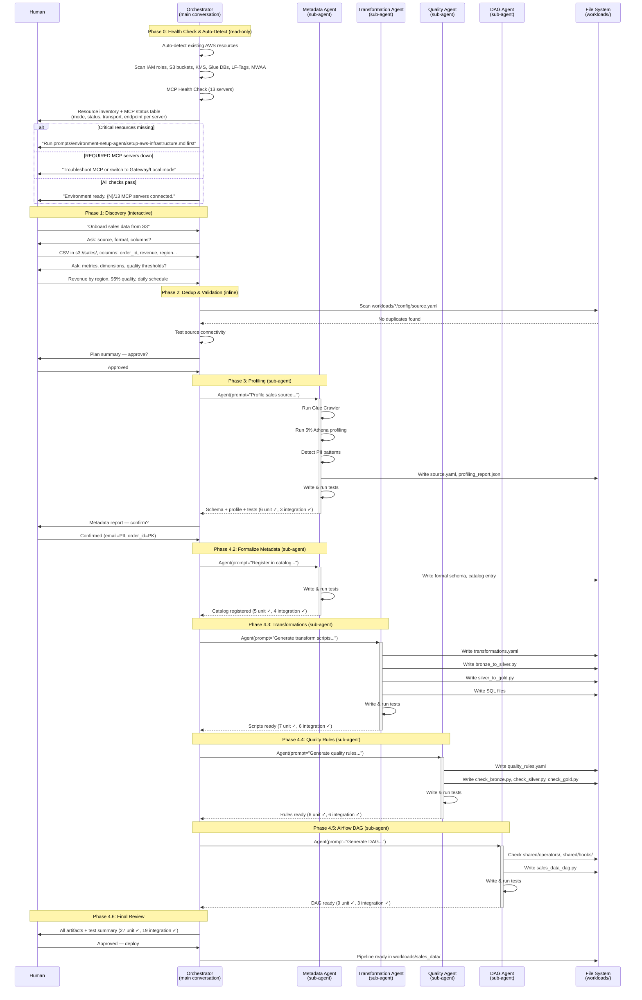
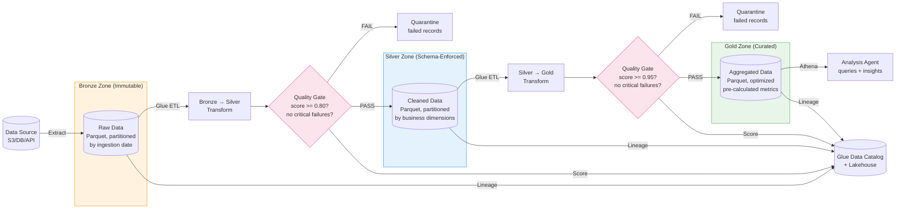

# Workflow Diagrams — Agentic Data Onboarding System

## 1. End-to-End Orchestration Flow

```mermaid
flowchart TD
    START([User Request]) --> ROUTER

    subgraph ROUTER_BLOCK["ROUTER AGENT (inline)"]
        ROUTER{Search workloads/}
        ROUTER -->|FOUND| EXISTING[Point to existing<br/>workload folder]
        ROUTER -->|PARTIAL| PARTIAL_MATCH[Report what exists<br/>Ask: complete or restart?]
        ROUTER -->|NOT FOUND| NEW[Start Data<br/>Onboarding Agent]
    end

    EXISTING --> WHAT_NEXT{What does<br/>user want?}
    WHAT_NEXT -->|Modify| PHASE1
    WHAT_NEXT -->|Query Gold| ANALYSIS_AGENT
    WHAT_NEXT -->|Check quality| QUALITY_AGENT_ADHOC
    PARTIAL_MATCH -->|Complete it| PHASE1
    PARTIAL_MATCH -->|Start fresh| PHASE1
    NEW --> PHASE1

    subgraph MAIN["DATA ONBOARDING AGENT (main conversation)"]

        subgraph P0["PHASE 0: Health Check & Auto-Detect (read-only)"]
            PHASE0[Auto-Detect Existing Resources]
            PHASE0 --> SCAN["Scan AWS Account<br/>IAM roles, S3 bucket, KMS keys,<br/>Glue DBs, LF-Tags, MWAA"]
            SCAN --> INVENTORY["Resource Inventory<br/>FOUND / NOT FOUND per resource"]
            INVENTORY --> HEALTH["MCP Health Check<br/>+ Endpoint Inventory"]
            HEALTH --> HC_TABLE["13 servers: status, transport, endpoint<br/>Mode: LOCAL (.mcp.json) / GATEWAY (.mcp.gateway.json)"]
            HC_TABLE --> P0_GATE{Phase 0 Gate}
            P0_GATE -->|"Critical resources missing"| SETUP_REDIRECT["Direct to<br/>prompts/environment-setup-agent/setup-aws-infrastructure.md"]
            P0_GATE -->|"REQUIRED MCP servers down"| MCP_FIX["Troubleshoot MCP<br/>or switch modes"]
            P0_GATE -->|"All checks pass"| PHASE1
        end

        subgraph P1["PHASE 1: Discovery (interactive)"]
            PHASE1[Ask clarifying questions]
            PHASE1 --> SRC[Data Source<br/>location, format, credentials]
            SRC --> DEST[Destination & Zones<br/>Bronze → Silver → Gold]
            DEST --> DOMAIN[Domain Context<br/>columns, metrics, dimensions]
            DOMAIN --> TRANSFORM_Q[Transformation Details<br/>cleaning, aggregation, schema evolution]
            TRANSFORM_Q --> QUALITY_Q[Quality & Compliance<br/>thresholds, PII, retention]
            QUALITY_Q --> SCHED[Scheduling<br/>cron, dependencies, failure handling]
        end

        SCHED --> PHASE2

        subgraph P2["PHASE 2: Dedup & Validation (inline)"]
            PHASE2[Duplicate Detection]
            PHASE2 -->|Scan all<br/>workloads/*/config/source.yaml| DEDUP{Duplicate<br/>found?}
            DEDUP -->|Exact duplicate| BLOCK[BLOCK<br/>Show existing workload]
            DEDUP -->|Overlap| WARN[WARN<br/>Ask: extend or separate?]
            DEDUP -->|No overlap| CONN_CHECK[Source Connectivity Check]
            CONN_CHECK --> REUSE_CHECK[Check shared/ for<br/>reusable assets]
            REUSE_CHECK --> PLAN[Summarize Plan<br/>to Human]
            PLAN --> APPROVE1{Human<br/>approves?}
            APPROVE1 -->|No| PHASE1
            APPROVE1 -->|Yes| PHASE3
        end

        subgraph P3["PHASE 3: Profiling (sub-agent)"]
            PHASE3[Spawn Metadata Agent]
            PHASE3 -->|Agent tool| META_PROFILE["Metadata Agent (sub-agent)<br/>───────────────────<br/>1. Run Glue Crawler<br/>2. 5% sample profiling via Athena<br/>3. Detect PII/PHI/PCI patterns<br/>4. Write tests"]
            META_PROFILE --> TG1{TEST GATE<br/>unit + integration}
            TG1 -->|FAIL| META_PROFILE
            TG1 -->|PASS| REPORT[Present Metadata Report<br/>to Human]
            REPORT --> CONFIRM{Human<br/>confirms?}
            CONFIRM -->|Corrections| PHASE3
            CONFIRM -->|Approved| PHASE4
        end

        subgraph P4["PHASE 4: Build Pipeline (sub-agents + test gates)"]
            PHASE4[Create workload folder structure]
            PHASE4 --> STEP42

            STEP42[Spawn Metadata Agent]
            STEP42 -->|Agent tool| META_FORMAL["Metadata Agent (sub-agent)<br/>───────────────────<br/>1. Formalize schema<br/>2. Apply PII classifications<br/>3. Register in Lakehouse Catalog<br/>4. Record lineage<br/>5. Write tests"]
            META_FORMAL --> TG2{TEST GATE<br/>5 unit, 4 integration}
            TG2 -->|FAIL x2| ESCALATE1[Escalate to Human]
            TG2 -->|FAIL| META_FORMAL
            TG2 -->|PASS| STEP43

            STEP43[Spawn Transformation Agent]
            STEP43 -->|Agent tool| TRANS["Transformation Agent (sub-agent)<br/>───────────────────<br/>1. Generate transformations.yaml<br/>2. Bronze→Silver script<br/>3. Silver→Gold script<br/>4. SQL for each zone<br/>5. Write tests"]
            TRANS --> TG3{TEST GATE<br/>7 unit, 6 integration}
            TG3 -->|FAIL x2| ESCALATE2[Escalate to Human]
            TG3 -->|FAIL| TRANS
            TG3 -->|PASS| STEP44

            STEP44[Spawn Quality Agent]
            STEP44 -->|Agent tool| QUAL["Quality Agent (sub-agent)<br/>───────────────────<br/>1. Generate quality_rules.yaml<br/>2. Set baselines from profiling<br/>3. Define quality gates<br/>4. Check scripts per zone<br/>5. Write tests"]
            QUAL --> TG4{TEST GATE<br/>6 unit, 6 integration}
            TG4 -->|FAIL x2| ESCALATE3[Escalate to Human]
            TG4 -->|FAIL| QUAL
            TG4 -->|PASS| STEP45

            STEP45[Spawn Orchestration DAG Agent]
            STEP45 -->|Agent tool| DAG["DAG Agent (sub-agent)<br/>───────────────────<br/>1. Check shared/ for reusables<br/>2. Generate Airflow DAG<br/>3. Wire dependencies<br/>4. Configure schedule + retries<br/>5. Write tests"]
            DAG --> TG5{TEST GATE<br/>9 unit, 3 integration}
            TG5 -->|FAIL x2| ESCALATE4[Escalate to Human]
            TG5 -->|FAIL| DAG
            TG5 -->|PASS| FINAL
        end

        FINAL[Present All Artifacts<br/>+ Test Summary to Human]
        FINAL --> APPROVE2{Human<br/>approves?}
        APPROVE2 -->|Changes needed| PHASE4
        APPROVE2 -->|Approved| DEPLOY

    end

    DEPLOY([Deploy Pipeline])

    ANALYSIS_AGENT["Analysis Agent (sub-agent)<br/>Read-only Gold zone queries"]
    QUALITY_AGENT_ADHOC["Quality Agent (sub-agent)<br/>Ad-hoc quality checks"]

    style ROUTER_BLOCK fill:#f0f4ff,stroke:#4a6fa5
    style MAIN fill:#fafafa,stroke:#333
    style P0 fill:#f3e5f5,stroke:#9c27b0
    style P1 fill:#e8f5e9,stroke:#4caf50
    style P2 fill:#fff3e0,stroke:#ff9800
    style P3 fill:#e3f2fd,stroke:#2196f3
    style P4 fill:#fce4ec,stroke:#e91e63
```



## 2. Sub-Agent Spawn & Test Gate Detail



## 3. Test Gate Decision Flow

```mermaid
flowchart TD
    SUBAGENT[Sub-Agent Returns<br/>artifacts + tests] --> RUN_UNIT[Run unit tests<br/>pytest tests/unit/test_{agent}.py]
    RUN_UNIT --> UNIT_PASS{Unit tests<br/>pass?}
    UNIT_PASS -->|YES| RUN_INT[Run integration tests<br/>pytest tests/integration/test_{agent}.py]
    UNIT_PASS -->|NO| ATTEMPT{Attempt<br/>count?}

    RUN_INT --> INT_PASS{Integration<br/>tests pass?}
    INT_PASS -->|YES| REPORT_PASS["✓ PASS<br/>Report: X unit, Y integration passed<br/>Proceed to next step"]
    INT_PASS -->|NO| ATTEMPT

    ATTEMPT -->|1st failure| RETRY["Re-spawn sub-agent<br/>with error context:<br/>- Which tests failed<br/>- Error messages<br/>- Expected vs actual"]
    ATTEMPT -->|2nd failure| ESCALATE["ESCALATE to Human<br/>───────────────────<br/>Show:<br/>- What the sub-agent produced<br/>- Which tests failed and why<br/>- Suggested fixes<br/>───────────────────<br/>Ask: fix manually / retry / skip?"]

    RETRY --> SUBAGENT

    ESCALATE --> HUMAN_DECISION{Human<br/>decides}
    HUMAN_DECISION -->|Fix and retry| SUBAGENT
    HUMAN_DECISION -->|Manual fix| MANUAL[Human edits files<br/>Re-run tests only]
    HUMAN_DECISION -->|Skip| SKIP["Skip this step<br/>(document gap in README)"]
    MANUAL --> RUN_UNIT

    style REPORT_PASS fill:#e8f5e9,stroke:#4caf50
    style ESCALATE fill:#fff3e0,stroke:#ff9800
    style SKIP fill:#fce4ec,stroke:#e91e63
```

## 4. Data Zone Progression with Quality Gates



## 5. Airflow DAG Task Flow

```mermaid
flowchart TD
    subgraph EXTRACT["TaskGroup: extract"]
        E1[extract_{workload}_to_bronze<br/>PythonOperator]
    end

    subgraph TRANSFORM["TaskGroup: transform"]
        T1[transform_bronze_to_silver<br/>PythonOperator]
        T1 --> QC1[quality_check_silver<br/>PythonOperator<br/>trigger_rule=all_success]
        QC1 --> T2[transform_silver_to_gold<br/>PythonOperator]
        T2 --> QC2[quality_check_gold<br/>PythonOperator<br/>trigger_rule=all_success]
    end

    subgraph CATALOG["TaskGroup: catalog"]
        C1[update_lakehouse_catalog<br/>PythonOperator]
    end

    subgraph NOTIFY["TaskGroup: notify"]
        N1[send_completion_alert<br/>on_success_callback]
    end

    EXTRACT --> TRANSFORM --> CATALOG --> NOTIFY

    QC1 -->|FAIL| ALERT1[on_failure_callback<br/>→ SNS → Slack/Email]
    QC2 -->|FAIL| ALERT2[on_failure_callback<br/>→ SNS → Slack/Email]

    style EXTRACT fill:#fff3e0,stroke:#ff9800
    style TRANSFORM fill:#e3f2fd,stroke:#2196f3
    style CATALOG fill:#e8f5e9,stroke:#4caf50
    style NOTIFY fill:#f3e5f5,stroke:#9c27b0
    style ALERT1 fill:#fce4ec,stroke:#e91e63
    style ALERT2 fill:#fce4ec,stroke:#e91e63
```

## 6. File System Layout After Onboarding

```
workloads/sales_data/
│
├── config/
│   ├── source.yaml              ← Metadata Agent (Phase 3 + 4.2)
│   ├── transformations.yaml     ← Transformation Agent (Phase 4.3)
│   ├── quality_rules.yaml       ← Quality Agent (Phase 4.4)
│   └── schedule.yaml            ← Orchestrator (Phase 4.1)
│
├── scripts/
│   ├── extract/
│   │   └── extract_sales.py     ← Orchestrator or Metadata Agent
│   ├── transform/
│   │   ├── bronze_to_silver.py  ← Transformation Agent (Phase 4.3)
│   │   └── silver_to_gold.py    ← Transformation Agent (Phase 4.3)
│   ├── quality/
│   │   ├── check_bronze.py      ← Quality Agent (Phase 4.4)
│   │   ├── check_silver.py      ← Quality Agent (Phase 4.4)
│   │   └── check_gold.py        ← Quality Agent (Phase 4.4)
│   └── load/
│
├── dags/
│   └── sales_data_dag.py        ← DAG Agent (Phase 4.5)
│
├── sql/
│   ├── bronze/
│   │   └── create_bronze.sql    ← Metadata Agent
│   ├── silver/
│   │   └── transform_silver.sql ← Transformation Agent
│   └── gold/
│       └── aggregate_gold.sql   ← Transformation Agent
│
├── tests/
│   ├── unit/
│   │   ├── test_metadata.py     ← Metadata Agent
│   │   ├── test_transformations.py ← Transformation Agent
│   │   ├── test_quality.py      ← Quality Agent
│   │   └── test_dag.py          ← DAG Agent
│   └── integration/
│       ├── test_metadata.py     ← Metadata Agent
│       ├── test_transformations.py ← Transformation Agent
│       ├── test_quality.py      ← Quality Agent
│       └── test_dag.py          ← DAG Agent
│
└── README.md                    ← Orchestrator (Phase 4.6)
```
